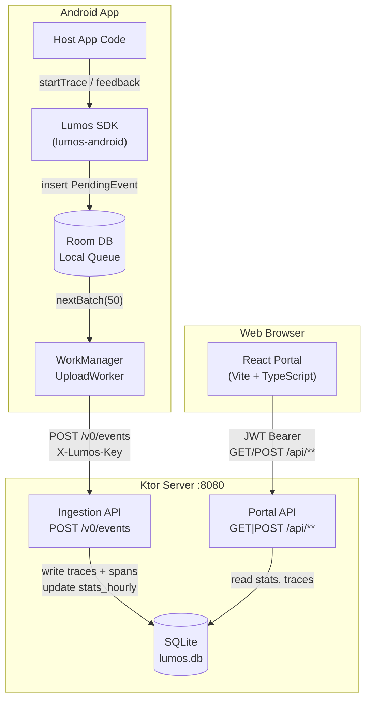
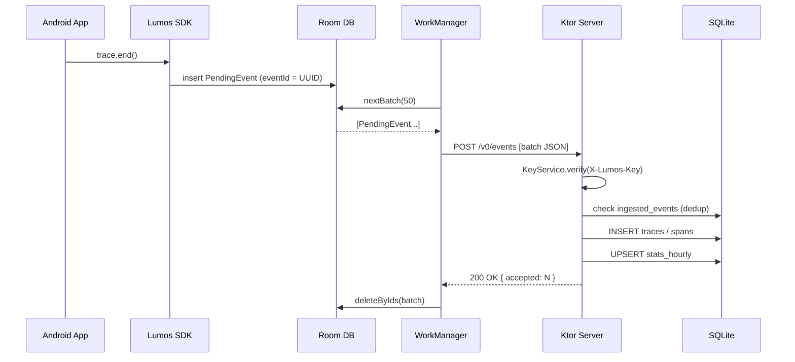
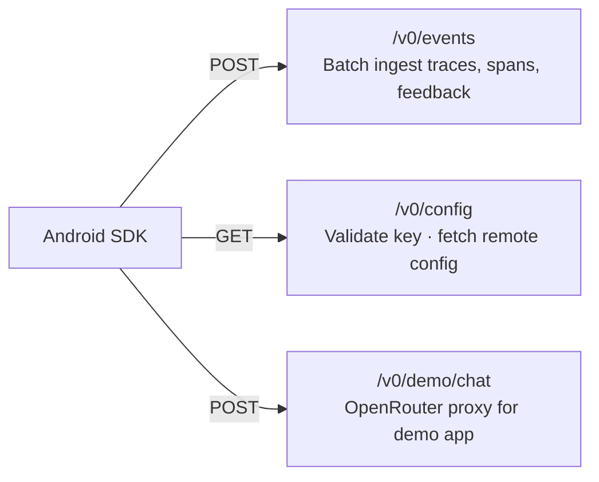
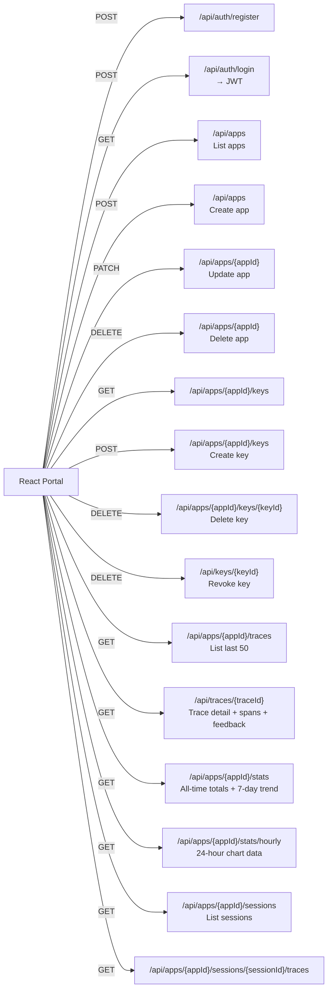

#  LumosSDK — AI Observability for Android

*Trace every AI conversation in your app. Visualize it in your own self-hosted portal.*


---

## What is LumosSDK?

LumosSDK is an open-source observability toolkit for Android apps powered by AI.
Drop the SDK in, and every AI call — prompt, response, model, latency, token cost, user feedback — flows automatically to a dashboard you host yourself.

| Property | Detail |
| --- | --- |
| **No third-party cloud** | Your conversation data never leaves your server |
| **Two-line setup** | `Lumos.init(context) { apiKey = "..."; serverUrl = "..." }` |
| **Full-stack** | Android SDK + Ktor backend + React portal, all in one repo |
| **Langfuse-inspired** | Same concept, built specifically for mobile AI apps |

---

## Features

### Android SDK (`lumos-android`)

- **One-line init** — `Lumos.init(context) { ... }` in `Application.onCreate()`
- **Trace AI calls** — capture prompt, response, model, token counts, latency
- **Span tracking** — instrument multi-step pipelines (retrieval, tool calls, etc.)
- **User feedback** — thumbs up/down tied directly to a trace
- **Offline-first** — events queue in a local Room database; WorkManager uploads when connected
- **Idempotent delivery** — exponential backoff + server-side dedup, no duplicates
- **Device context** — auto-attaches device model, Android version, app version

### Server (`server`)

- **Dual auth** — API key (`X-Lumos-Key`) for SDK ingestion, JWT for the portal
- **Idempotency** — `ingested_events` table prevents duplicate processing
- **Pre-aggregated stats** — `stats_hourly` rollup table; dashboard never scans raw traces
- **Session grouping** — traces are grouped by session ID for conversation replay
- **OpenRouter proxy** — built-in demo chat endpoint

### Portal (`portal`)

- **Dashboard** — total calls, error rate, avg latency, token spend, thumbs up/down
- **7-day trend** — compare current week vs. previous week for every metric
- **24-hour chart** — per-hour call volume for the last 24 hours
- **Trace Explorer** — full prompt/reply, span timeline, device info, feedback per trace
- **Session view** — replay all traces in a user session in order
- **API Key management** — create, revoke, last-used timestamps

---

## Screenshots

| Dashboard | Trace Detail | API Keys |
| --------- | ------------ | -------- |
|  |  |  |

| Traces List | Login |
| ----------- | ----- |
|  |  |

---

## Architecture



### Data Flow — Ingestion



---

## API Endpoints

### SDK Ingestion — `X-Lumos-Key` header



| Method | Endpoint | Auth | Description |
| ------ | -------- | ---- | ----------- |
| `POST` | `/v0/events` | API Key | Ingest a batch of `TRACE` / `SPAN` / `FEEDBACK` envelopes |
| `GET` | `/v0/config` | API Key | Verify the key and return active config |
| `POST` | `/v0/demo/chat` | API Key | Proxy chat completion to OpenRouter |

### Portal API — `Authorization: Bearer <JWT>`



---

## How to Implement in Your Project

### Step 1 — Add the SDK

In your root `settings.gradle.kts`, include the local build:

```kotlin
includeBuild("../lumos-android")
```

In your `app/build.gradle.kts`:

```kotlin
dependencies {
    implementation("com.lumos:lumos-android:0.1.0")
}
```

Add the internet permission to `AndroidManifest.xml`:

```xml
<uses-permission android:name="android.permission.INTERNET" />
```

### Step 2 — Initialize once

```kotlin
class MyApp : Application() {
    override fun onCreate() {
        super.onCreate()
        Lumos.init(this) {
            apiKey    = "lms_abc123..."           // copied from the portal
            serverUrl = "https://your-server.com"
        }
    }
}
```

### Step 3 — Start the server

```bash
cd server

# Required env vars
export JWT_SECRET="a-long-random-secret"
export OPENROUTER_API_KEY="sk-or-..."

gradle run          # starts on :8080
```

### Step 4 — Open the portal

```bash
cd portal
npm install
VITE_API_URL=http://localhost:8080 npm run dev
```

Register an account, create an app, generate an API key — paste it into Step 2.

---

## How to Use

### Trace a single AI call

```kotlin
val trace = Lumos.startTrace("support-chat")

trace.logPrompt(userMessage)

val reply = myAIClient.complete(userMessage)   // your existing AI call

trace.logResponse(
    text      = reply,
    model     = "gpt-4o-mini",
    tokensIn  = 200,
    tokensOut = 80,
    latencyMs = 1200,
)
trace.end()
```

### Trace a multi-step pipeline with spans

```kotlin
val trace = Lumos.startTrace("rag-pipeline")
trace.logPrompt(query)

val retrieval = trace.startSpan("vector-retrieval")
val docs = vectorStore.search(query)
retrieval.end()

val llmCall = trace.startSpan("llm-completion")
val answer = llm.complete(query, docs)
llmCall.end()

trace.logResponse(answer, model = "gpt-4o", tokensIn = 800, tokensOut = 150)
trace.end()
```

### Capture user feedback

```kotlin
// When the user taps 👍
Lumos.feedback(trace.id, Feedback.ThumbsUp)

// When the user taps 👎
Lumos.feedback(trace.id, Feedback.ThumbsDown)
```

### Handle errors

```kotlin
val trace = Lumos.startTrace("classification")
trace.logPrompt(input)
try {
    val result = aiClient.classify(input)
    trace.logResponse(result, model = "gpt-4o-mini")
    trace.end()
} catch (e: Exception) {
    trace.logError(e)
    trace.end()
}
```

## Tech Stack

| Layer | Technology |
| ----- | ---------- |
| Android SDK | Kotlin · Room (local queue) · WorkManager (upload) · kotlinx.serialization |
| Server | Ktor · Exposed ORM · SQLite · JWT (HMAC-256) · BCrypt |
| Portal | React 19 · TypeScript · Vite · Recharts · Axios |
| Auth (SDK) | API key — stored SHA-256 hashed in DB, sent in `X-Lumos-Key` header |
| Auth (Portal) | JWT — signed HMAC-256, `accountId` claim, 24h expiry |

---

**Author:** Offir Tura
