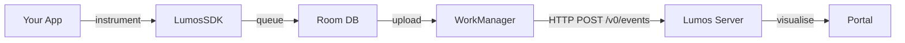

# Portal Improvements Implementation Plan

> **For agentic workers:** REQUIRED SUB-SKILL: Use superpowers:subagent-driven-development (recommended) or superpowers:executing-plans to implement this plan task-by-task. Steps use checkbox (`- [ ]`) syntax for tracking.

**Goal:** Deliver eight portal improvements: theme system (light/dark), apps as cards, settings page, numbers font fix, docs page, SDK README, sessions page, and persisted trace filter.

**Architecture:** CSS custom properties on `<html>` drive the theme; a `ThemeContext` syncs `localStorage` + system preference. New pages (`/settings`, `/sessions`, `/docs`) follow the existing route + NavBar pattern. Two new server routes handle account management and session aggregation.

**Tech Stack:** React 19, TypeScript, Vite, React Router, Kotlin/Ktor, Exposed, SQLite, Playwright (screenshots).

## Global Constraints

- All portal commands run from `portal/` unless stated otherwise
- All server commands run from `server/` unless stated otherwise
- TypeScript correctness gate: `npx tsc -b` must exit 0 after every portal task
- New server DB columns must be `.nullable()` — SQLite cannot add non-null columns to populated tables
- No Co-Authored-By in commit messages
- Do not use `T.fontD` for numeric metric values
- Public route `/docs` must NOT be wrapped in `RequireAuth` or `Protected`
- Every new server route under `/api/apps/:appId/` must verify app ownership (return 403 if `app.accountId != accountId`)

---

## File Map

| File | Task | Action |
|------|------|--------|
| `portal/src/index.css` | 1 | Modify — add CSS custom properties |
| `portal/src/theme.ts` | 1 | Modify — rewrite T to use `var(--color-X)` |
| `portal/src/ThemeContext.tsx` | 1 | Create |
| `portal/src/components/NavBar.tsx` | 1, 6, 8, 9 | Modify — add toggle + new nav links |
| `portal/src/App.tsx` | 1, 6, 8, 9 | Modify — wrap ThemeProvider, add routes |
| `portal/src/components/StatsCard.tsx` | 2 | Modify — font fix |
| `portal/src/pages/Dashboard.tsx` | 2 | Modify — font fix |
| `portal/src/pages/Apps.tsx` | 3 | Modify — card grid layout |
| `portal/src/pages/TraceExplorer.tsx` | 4 | Modify — persist time range |
| `server/src/main/kotlin/com/lumos/server/db/Tables.kt` | 5 | Modify — add nullable columns |
| `server/src/main/kotlin/com/lumos/server/routes/AccountRoutes.kt` | 5 | Create |
| `server/src/main/kotlin/com/lumos/server/Application.kt` | 5, 7 | Modify — register new routes |
| `portal/src/pages/Settings.tsx` | 6 | Create |
| `server/src/main/kotlin/com/lumos/server/routes/SessionRoutes.kt` | 7 | Create |
| `portal/src/pages/Sessions.tsx` | 8 | Create |
| `portal/src/pages/Docs.tsx` | 9 | Create |
| `lumos-android/README.md` | 10 | Create |
| `lumos-android/docs/icons/` | 10 | Create — Lucide SVG assets |
| `lumos-android/docs/screenshots/` | 10 | Create — Playwright screenshots |

---

## Task 1: Theme System

**Files:**
- Modify: `portal/src/index.css`
- Modify: `portal/src/theme.ts`
- Create: `portal/src/ThemeContext.tsx`
- Modify: `portal/src/components/NavBar.tsx`
- Modify: `portal/src/App.tsx`

**Interfaces:**
- Produces: `useTheme(): { mode: 'dark'|'light'|'system', setMode: (m) => void }` used by NavBar toggle
- Produces: all `T.X` values are now CSS var references — all existing inline style usages automatically update

- [ ] **Step 1: Rewrite `portal/src/index.css`**

Replace the entire file:

```css
* { box-sizing: border-box; margin: 0; padding: 0; }

:root {
  --color-bg:           #040810;
  --color-surface:      #070D1C;
  --color-card:         #0B1628;
  --color-card2:        #0F1E38;
  --color-border:       #2E3D54;
  --color-text:         #E8F2FF;
  --color-muted:        #6A7D9A;
  --color-cyan:         #00D4FF;
  --color-cyan-rgb:     0,212,255;
  --color-purple:       #7B5FFF;
  --color-purple-rgb:   123,95,255;
  --color-green:        #00E887;
  --color-green-rgb:    0,232,135;
  --color-amber:        #FFB800;
  --color-red:          #FF4563;
  --color-red-rgb:      255,69,99;
  --color-border-rgb:   46,61,84;
  --color-skeleton-from: #0B1628;
  --color-skeleton-mid:  #162340;
}

[data-theme="light"] {
  --color-bg:           #F4F7FC;
  --color-surface:      #FFFFFF;
  --color-card:         #FFFFFF;
  --color-card2:        #EEF2FA;
  --color-border:       #D0DCF0;
  --color-text:         #0D1A2E;
  --color-muted:        #5A6E8C;
  --color-cyan:         #0099BB;
  --color-cyan-rgb:     0,153,187;
  --color-purple:       #6344E0;
  --color-purple-rgb:   99,68,224;
  --color-green:        #00A85A;
  --color-green-rgb:    0,168,90;
  --color-amber:        #C98A00;
  --color-red:          #D93050;
  --color-red-rgb:      217,48,80;
  --color-border-rgb:   208,220,240;
  --color-skeleton-from: #E8ECEF;
  --color-skeleton-mid:  #F5F7FA;
}

body {
  font-family: 'Satoshi', 'Inter', system-ui, sans-serif;
  background: var(--color-bg);
  color: var(--color-text);
}

body::before {
  content: '';
  position: fixed;
  inset: 0;
  background-image:
    linear-gradient(rgba(var(--color-cyan-rgb), 0.035) 1px, transparent 1px),
    linear-gradient(90deg, rgba(var(--color-cyan-rgb), 0.035) 1px, transparent 1px);
  background-size: 80px 80px;
  pointer-events: none;
  z-index: 0;
}

#root {
  min-height: 100vh;
  width: 100%;
  position: relative;
  z-index: 1;
}

::-webkit-scrollbar { width: 6px; }
::-webkit-scrollbar-track { background: transparent; }
::-webkit-scrollbar-thumb { background: var(--color-border); border-radius: 3px; }
::-webkit-scrollbar-thumb:hover { background: var(--color-cyan); }

@keyframes shimmer {
  0%   { background-position: -400px 0; }
  100% { background-position: 400px 0; }
}
```

- [ ] **Step 2: Rewrite `portal/src/theme.ts`**

```typescript
import type React from 'react';

export const T = {
  bg:      'var(--color-bg)',
  surface: 'var(--color-surface)',
  card:    'var(--color-card)',
  card2:   'var(--color-card2)',
  border:  'var(--color-border)',
  text:    'var(--color-text)',
  muted:   'var(--color-muted)',
  cyan:    'var(--color-cyan)',
  purple:  'var(--color-purple)',
  green:   'var(--color-green)',
  amber:   'var(--color-amber)',
  red:     'var(--color-red)',
  grad:    'linear-gradient(135deg, var(--color-cyan) 0%, var(--color-purple) 100%)',
  fontD:   "'Clash Display', sans-serif",
  fontM:   "'JetBrains Mono', monospace",
} as const;

export const cardStyle: React.CSSProperties = {
  background:   'var(--color-card)',
  border:       '1px solid var(--color-border)',
  borderRadius: 18,
};

export const gradientText: React.CSSProperties = {
  background:           'linear-gradient(135deg, var(--color-cyan) 0%, var(--color-purple) 100%)',
  WebkitBackgroundClip: 'text',
  WebkitTextFillColor:  'transparent',
  backgroundClip:       'text',
};

export const skeletonStyle: React.CSSProperties = {
  background:     'linear-gradient(90deg, var(--color-skeleton-from) 0px, var(--color-skeleton-mid) 200px, var(--color-skeleton-from) 400px)',
  backgroundSize: '800px 100%',
  animation:      'shimmer 1.6s ease-in-out infinite',
  borderRadius:   10,
};

export const transition = 'all 200ms ease-out';
```

- [ ] **Step 3: Update hardcoded rgba() values across portal components**

Run this grep to find every file with hardcoded rgba color values:

```bash
grep -rl "rgba(0,212,255\|rgba(255,69,99\|rgba(123,95,255\|rgba(0,232,135\|rgba(46,61,84" portal/src/
```

In every matched file, apply these substitutions (use find-and-replace in editor):

| Find | Replace |
|------|---------|
| `rgba(0,212,255,` | `rgba(var(--color-cyan-rgb),` |
| `rgba(255,69,99,` | `rgba(var(--color-red-rgb),` |
| `rgba(123,95,255,` | `rgba(var(--color-purple-rgb),` |
| `rgba(0,232,135,` | `rgba(var(--color-green-rgb),` |
| `rgba(46,61,84,` | `rgba(var(--color-border-rgb),` |

Note: `rgba(0,0,0,X)` shadow values are intentional and stay unchanged.

- [ ] **Step 4: Create `portal/src/ThemeContext.tsx`**

```tsx
import { createContext, useContext, useEffect, useState } from 'react';

type ThemeMode = 'dark' | 'light' | 'system';

interface ThemeContextValue {
  mode: ThemeMode;
  setMode: (m: ThemeMode) => void;
}

const ThemeContext = createContext<ThemeContextValue>({ mode: 'system', setMode: () => {} });

export function ThemeProvider({ children }: { children: React.ReactNode }) {
  const [mode, setModeState] = useState<ThemeMode>(
    () => (localStorage.getItem('lumos_theme') as ThemeMode) ?? 'system'
  );

  useEffect(() => {
    function apply(m: ThemeMode) {
      const isDark =
        m === 'dark' || (m === 'system' && matchMedia('(prefers-color-scheme: dark)').matches);
      document.documentElement.dataset.theme = isDark ? 'dark' : 'light';
    }
    apply(mode);
    if (mode === 'system') {
      const mq = matchMedia('(prefers-color-scheme: dark)');
      const handler = () => apply('system');
      mq.addEventListener('change', handler);
      return () => mq.removeEventListener('change', handler);
    }
  }, [mode]);

  function setMode(m: ThemeMode) {
    localStorage.setItem('lumos_theme', m);
    setModeState(m);
  }

  return <ThemeContext.Provider value={{ mode, setMode }}>{children}</ThemeContext.Provider>;
}

export const useTheme = () => useContext(ThemeContext);
```

- [ ] **Step 5: Add ThemeToggle to `portal/src/components/NavBar.tsx`**

Add import at top:
```tsx
import { Moon, Sun, Monitor } from 'lucide-react';
import { useTheme } from '../ThemeContext';
```

Add `ThemeToggle` component before the `NavBar` export:
```tsx
type ThemeMode = 'dark' | 'light' | 'system';

function ThemeToggle() {
  const { mode, setMode } = useTheme();
  const cycle: Record<ThemeMode, ThemeMode> = { system: 'dark', dark: 'light', light: 'system' };
  const icon = mode === 'dark' ? <Moon size={15} /> : mode === 'light' ? <Sun size={15} /> : <Monitor size={15} />;
  const label = `Theme: ${mode}`;
  return (
    <button
      onClick={() => setMode(cycle[mode])}
      title={label}
      style={{
        display: 'flex', alignItems: 'center', justifyContent: 'center',
        width: 36, height: 36, borderRadius: 8,
        background: 'none', border: `1px solid var(--color-border)`,
        color: 'var(--color-muted)', cursor: 'pointer', transition,
      }}
    >
      {icon}
    </button>
  );
}
```

In the NavBar bottom section, add `<ThemeToggle />` above the app switcher div:
```tsx
<div style={{ marginTop: 'auto', display: 'flex', flexDirection: 'column', gap: 8 }}>
  <div style={{ display: 'flex', justifyContent: 'flex-end' }}>
    <ThemeToggle />
  </div>
  {/* App switcher — existing code */}
```

- [ ] **Step 6: Wrap App with ThemeProvider in `portal/src/App.tsx`**

Add import: `import { ThemeProvider } from './ThemeContext';`

Wrap the `AuthProvider` with `ThemeProvider`:
```tsx
export default function App() {
  return (
    <ThemeProvider>
      <AuthProvider>
        <BrowserRouter>
          {/* existing Routes ... */}
        </BrowserRouter>
      </AuthProvider>
    </ThemeProvider>
  );
}
```

- [ ] **Step 7: Verify TypeScript and run dev server**

```bash
npx tsc -b
```
Expected: exits 0 with no errors.

Start dev server: `npm run dev`. Open the portal, click the theme toggle, verify the page switches between dark and light. Check that system preference works on first load (open in incognito with system set to light).

- [ ] **Step 8: Commit**

```bash
git add portal/src/index.css portal/src/theme.ts portal/src/ThemeContext.tsx portal/src/components/NavBar.tsx portal/src/App.tsx
git commit -m "feat(portal): add CSS-variable theme system with light/dark/system toggle"
```

---

## Task 2: Numbers Font Fix

**Files:**
- Modify: `portal/src/components/StatsCard.tsx:68`
- Modify: `portal/src/pages/Dashboard.tsx:181`

**Interfaces:**
- Consumes: nothing new
- Produces: numeric values use body font instead of Clash Display

- [ ] **Step 1: Fix `StatsCard.tsx`**

At line 68, change `fontFamily: T.fontD` to `fontFamily: "'Satoshi', 'Inter', system-ui, sans-serif"`:

```tsx
<span style={{
  fontSize: 42, fontWeight: 700,
  fontFamily: "'Satoshi', 'Inter', system-ui, sans-serif",
  letterSpacing: '-0.02em',
  color,
  lineHeight: 1,
}}>
  {value}
</span>
```

- [ ] **Step 2: Fix `Dashboard.tsx` secondary metric cards**

Around line 181, the secondary metric value `<span>` uses `fontFamily: T.fontD`. Change to body font:

```tsx
<span style={{ fontSize: 30, fontWeight: 700, fontFamily: "'Satoshi', 'Inter', system-ui, sans-serif", color, letterSpacing: '-0.02em', lineHeight: 1 }}>
  {value}
</span>
```

Also fix the donut chart center number around line 248:
```tsx
<span style={{
  fontSize: 32, fontWeight: 700,
  fontFamily: "'Satoshi', 'Inter', system-ui, sans-serif",
  letterSpacing: '-0.02em',
  ...gradientText,
}}>
  {thumbsRatio}%
</span>
```

- [ ] **Step 3: Verify and commit**

```bash
npx tsc -b
git add portal/src/components/StatsCard.tsx portal/src/pages/Dashboard.tsx
git commit -m "fix(portal): use body font for numeric metric values instead of display font"
```

---

## Task 3: Apps as Cards

**Files:**
- Modify: `portal/src/pages/Apps.tsx`

- [ ] **Step 1: Rewrite `portal/src/pages/Apps.tsx`**

```tsx
import { useState } from 'react';
import { Boxes, Plus, Trash2, Check, X, Package } from 'lucide-react';
import { api } from '../api/client';
import { useApps, type App } from '../app/AppContext';
import PageHeader from '../components/PageHeader';
import { T, cardStyle, transition } from '../theme';

export default function Apps() {
  const { apps, currentAppId, setCurrentAppId, refresh } = useApps();
  const [showForm, setShowForm] = useState(false);
  const [name, setName] = useState('');
  const [pkg, setPkg] = useState('');
  const [editingId, setEditingId] = useState<string | null>(null);
  const [editName, setEditName] = useState('');

  async function create() {
    if (!name.trim() || !pkg.trim()) return;
    const res = await api.post('/api/apps', { name, packageName: pkg });
    setName(''); setPkg(''); setShowForm(false);
    await refresh();
    setCurrentAppId(res.data.id);
  }

  async function saveRename(id: string) {
    if (editName.trim()) await api.patch(`/api/apps/${id}`, { name: editName });
    setEditingId(null);
    await refresh();
  }

  async function remove(app: App) {
    if (!window.confirm(`Delete "${app.name}" and all its traces and keys? This cannot be undone.`)) return;
    await api.delete(`/api/apps/${app.id}`);
    await refresh();
  }

  return (
    <div>
      <PageHeader
        icon={<Boxes size={16} color={T.cyan} strokeWidth={1.5} />}
        title="Apps" subtitle="Create and manage your apps"
        accent="#00D4FF"
        titleGradient="linear-gradient(135deg, #E8F2FF 0%, #00D4FF 100%)"
      />

      <div style={{
        display: 'grid',
        gridTemplateColumns: 'repeat(auto-fill, minmax(280px, 1fr))',
        gap: 16,
      }}>
        {/* New App card */}
        {!showForm ? (
          <button
            onClick={() => setShowForm(true)}
            style={{
              ...cardStyle,
              padding: '32px 24px',
              display: 'flex', flexDirection: 'column',
              alignItems: 'center', justifyContent: 'center',
              gap: 12, cursor: 'pointer',
              border: `2px dashed var(--color-border)`,
              background: 'transparent',
              transition,
              minHeight: 160,
            }}
            onMouseEnter={e => { e.currentTarget.style.borderColor = T.cyan; e.currentTarget.style.color = T.cyan; }}
            onMouseLeave={e => { e.currentTarget.style.borderColor = 'var(--color-border)'; e.currentTarget.style.color = T.muted; }}
          >
            <Plus size={28} color={T.muted} strokeWidth={1.5} />
            <span style={{ fontSize: 14, fontWeight: 600, color: T.muted }}>New App</span>
          </button>
        ) : (
          <div style={{ ...cardStyle, padding: 24, display: 'flex', flexDirection: 'column', gap: 12, minHeight: 160 }}>
            <p style={{ fontSize: 13, fontWeight: 600, color: T.text }}>New App</p>
            <input value={name} onChange={e => setName(e.target.value)} placeholder="App name" style={inputStyle} />
            <input value={pkg} onChange={e => setPkg(e.target.value)} placeholder="com.acme.app" style={inputStyle} />
            <div style={{ display: 'flex', gap: 8 }}>
              <button onClick={create} style={primaryBtn}>Create</button>
              <button onClick={() => { setShowForm(false); setName(''); setPkg(''); }} style={ghostBtn}>Cancel</button>
            </div>
          </div>
        )}

        {/* App cards */}
        {apps.map(app => {
          const isActive = app.id === currentAppId;
          return (
            <div
              key={app.id}
              style={{
                ...cardStyle,
                padding: 0,
                display: 'flex', flexDirection: 'column',
                borderColor: isActive ? T.cyan : 'var(--color-border)',
                boxShadow: isActive ? `0 0 24px rgba(var(--color-cyan-rgb),0.15)` : 'none',
                transition,
                overflow: 'hidden',
              }}
              onMouseEnter={e => {
                if (!isActive) (e.currentTarget as HTMLElement).style.transform = 'translateY(-2px)';
                (e.currentTarget as HTMLElement).style.boxShadow = isActive
                  ? `0 0 24px rgba(var(--color-cyan-rgb),0.2)`
                  : '0 8px 24px rgba(0,0,0,0.2)';
              }}
              onMouseLeave={e => {
                (e.currentTarget as HTMLElement).style.transform = 'none';
                (e.currentTarget as HTMLElement).style.boxShadow = isActive ? `0 0 24px rgba(var(--color-cyan-rgb),0.15)` : 'none';
              }}
            >
              {/* Card header accent */}
              {isActive && (
                <div style={{ height: 3, background: 'linear-gradient(90deg, var(--color-cyan), var(--color-purple))' }} />
              )}

              <div style={{ padding: '20px 22px', flex: 1 }}>
                <div style={{ display: 'flex', alignItems: 'flex-start', gap: 12, marginBottom: 12 }}>
                  <div style={{
                    width: 40, height: 40, borderRadius: 10, flexShrink: 0,
                    background: `rgba(var(--color-cyan-rgb),0.08)`,
                    border: `1px solid rgba(var(--color-cyan-rgb),0.2)`,
                    display: 'flex', alignItems: 'center', justifyContent: 'center',
                  }}>
                    <Package size={18} color={T.cyan} strokeWidth={1.5} />
                  </div>
                  <div style={{ flex: 1, overflow: 'hidden' }}>
                    {editingId === app.id ? (
                      <div style={{ display: 'flex', gap: 6, alignItems: 'center' }}>
                        <input
                          value={editName}
                          onChange={e => setEditName(e.target.value)}
                          onKeyDown={e => { if (e.key === 'Enter') saveRename(app.id); if (e.key === 'Escape') setEditingId(null); }}
                          style={{ ...inputStyle, fontSize: 13 }}
                          autoFocus
                        />
                        <button onClick={() => saveRename(app.id)} style={iconBtn}><Check size={14} color={T.green} /></button>
                        <button onClick={() => setEditingId(null)} style={iconBtn}><X size={14} color={T.muted} /></button>
                      </div>
                    ) : (
                      <>
                        <p style={{ fontSize: 15, fontWeight: 600, color: T.text, marginBottom: 2, whiteSpace: 'nowrap', overflow: 'hidden', textOverflow: 'ellipsis' }}>
                          {app.name}
                        </p>
                        <p style={{ fontSize: 11, color: T.muted, fontFamily: T.fontM, whiteSpace: 'nowrap', overflow: 'hidden', textOverflow: 'ellipsis' }}>
                          {app.packageName}
                        </p>
                      </>
                    )}
                  </div>
                  {isActive && (
                    <span style={{
                      fontSize: 10, fontWeight: 700, color: T.cyan,
                      fontFamily: T.fontM, letterSpacing: '0.08em',
                      background: `rgba(var(--color-cyan-rgb),0.1)`,
                      border: `1px solid rgba(var(--color-cyan-rgb),0.3)`,
                      borderRadius: 6, padding: '2px 8px', flexShrink: 0,
                    }}>
                      ACTIVE
                    </span>
                  )}
                </div>
              </div>

              {/* Card footer */}
              <div style={{
                padding: '12px 22px',
                borderTop: '1px solid var(--color-border)',
                display: 'flex', alignItems: 'center', gap: 8,
              }}>
                {!isActive && (
                  <button onClick={() => setCurrentAppId(app.id)} style={primaryBtn}>
                    Select
                  </button>
                )}
                <button
                  onClick={() => { setEditingId(app.id); setEditName(app.name); }}
                  style={ghostBtn}
                >
                  Rename
                </button>
                <button onClick={() => remove(app)} style={{ ...iconBtn, marginLeft: 'auto' }} title="Delete">
                  <Trash2 size={15} color={T.red} />
                </button>
              </div>
            </div>
          );
        })}
      </div>
    </div>
  );
}

const inputStyle: React.CSSProperties = {
  padding: '9px 12px', borderRadius: 8, border: '1px solid var(--color-border)',
  background: 'var(--color-bg)', color: 'var(--color-text)', fontSize: 14, outline: 'none', width: '100%',
};
const primaryBtn: React.CSSProperties = {
  background: T.grad, border: 'none', color: '#fff', fontWeight: 600,
  padding: '8px 16px', borderRadius: 8, cursor: 'pointer', fontSize: 13,
};
const ghostBtn: React.CSSProperties = {
  background: 'none', border: '1px solid var(--color-border)', color: T.muted,
  borderRadius: 8, padding: '6px 12px', cursor: 'pointer', fontSize: 12, transition,
};
const iconBtn: React.CSSProperties = {
  background: 'none', border: 'none', cursor: 'pointer', padding: 4, display: 'flex',
};
```

- [ ] **Step 2: Verify and commit**

```bash
npx tsc -b
git add portal/src/pages/Apps.tsx
git commit -m "feat(portal): display apps as interactive cards in a responsive grid"
```

---

## Task 4: Persist Trace Days Filter

**Files:**
- Modify: `portal/src/pages/TraceExplorer.tsx:129`

- [ ] **Step 1: Update state initialization and add handler**

At line 129 in `TraceExplorer.tsx`, change the `timeRange` state initialization and add a `handleTimeRange` helper:

Change:
```tsx
const [timeRange, setTimeRange]     = useState('1d');
```
To:
```tsx
const [timeRange, setTimeRange] = useState<string>(
  () => localStorage.getItem('lumos_trace_days') ?? '7d'
);
```

Add this function directly after the `resetPage` function (after line 163):
```tsx
function handleTimeRange(k: string) {
  localStorage.setItem('lumos_trace_days', k);
  setTimeRange(k);
  resetPage();
}
```

- [ ] **Step 2: Use `handleTimeRange` in the two call sites**

Replace the `TimeRangeSelector`'s `onChange` prop (around line 182):
```tsx
<TimeRangeSelector value={timeRange} onChange={handleTimeRange} />
```

Replace the "Clear filters" button's `onClick` reset of `timeRange` (around line 325):
```tsx
onClick={() => { setStatus('ALL'); setFeature('ALL'); setSearch(''); handleTimeRange('7d'); }}
```

- [ ] **Step 3: Verify and commit**

```bash
npx tsc -b
git add portal/src/pages/TraceExplorer.tsx
git commit -m "fix(portal): persist trace time range filter across navigation and reloads"
```

---

## Task 5: Settings — Server Side

**Files:**
- Modify: `server/src/main/kotlin/com/lumos/server/db/Tables.kt`
- Create: `server/src/main/kotlin/com/lumos/server/routes/AccountRoutes.kt`
- Modify: `server/src/main/kotlin/com/lumos/server/Application.kt`

**Interfaces:**
- Produces: `PATCH /api/account` — updates name and/or email for the JWT account
- Produces: `DELETE /api/account` — deletes the account and all its apps/keys/traces

- [ ] **Step 1: Add nullable columns to Tables.kt**

In `Tables.kt`, add to `Accounts`:
```kotlin
object Accounts : Table("accounts") {
    val id = varchar("id", 36)
    val email = varchar("email", 255).uniqueIndex()
    val passwordHash = varchar("password_hash", 255)
    val name = varchar("name", 100).nullable()   // ADD THIS
    val createdAt = datetime("created_at")
    override val primaryKey = PrimaryKey(id)
}
```

Add to `Apps`:
```kotlin
object Apps : Table("apps") {
    val id = varchar("id", 36)
    val accountId = varchar("account_id", 36).references(Accounts.id)
    val name = varchar("name", 100)
    val packageName = varchar("package_name", 255)
    val debug = bool("debug").nullable()   // ADD THIS
    val createdAt = datetime("created_at")
    override val primaryKey = PrimaryKey(id)
}
```

`SchemaUtils.createMissingTablesAndColumns` in `DatabaseFactory.init()` will add these columns on server boot automatically.

- [ ] **Step 2: Write failing test for `PATCH /api/account`**

Create `server/src/test/kotlin/com/lumos/server/AccountRoutesTest.kt`:

```kotlin
package com.lumos.server

import com.lumos.server.db.Accounts
import com.lumos.server.db.DatabaseFactory
import io.ktor.client.request.*
import io.ktor.client.statement.*
import io.ktor.http.*
import io.ktor.server.testing.*
import kotlinx.serialization.json.*
import org.jetbrains.exposed.sql.insert
import org.jetbrains.exposed.sql.select
import org.jetbrains.exposed.sql.transactions.transaction
import org.junit.BeforeClass
import org.junit.Test
import org.mindrot.jbcrypt.BCrypt
import java.time.LocalDateTime
import java.util.UUID
import kotlin.test.assertEquals

class AccountRoutesTest {
    companion object {
        private const val TEST_EMAIL = "account-test@lumos.dev"
        private const val TEST_PASSWORD = "password123"
        private var testAccountId = ""
        private var testJwt = ""

        @BeforeClass
        @JvmStatic
        fun setup() {
            DatabaseFactory.init("jdbc:sqlite::memory:")
            testAccountId = UUID.randomUUID().toString()
            transaction {
                Accounts.insert {
                    it[id] = testAccountId
                    it[email] = TEST_EMAIL
                    it[passwordHash] = BCrypt.hashpw(TEST_PASSWORD, BCrypt.gensalt())
                    it[createdAt] = LocalDateTime.now()
                }
            }
        }
    }

    @Test
    fun `PATCH account updates name`() = testApplication {
        application { module() }
        // Login to get JWT
        val loginRes = client.post("/api/auth/login") {
            contentType(ContentType.Application.Json)
            setBody("""{"email":"$TEST_EMAIL","password":"$TEST_PASSWORD"}""")
        }
        val jwt = Json.parseToJsonElement(loginRes.bodyAsText()).jsonObject["token"]!!.jsonPrimitive.content

        val patchRes = client.patch("/api/account") {
            contentType(ContentType.Application.Json)
            header("Authorization", "Bearer $jwt")
            setBody("""{"name":"Acme Corp"}""")
        }
        assertEquals(HttpStatusCode.OK, patchRes.status)
        val updated = transaction { Accounts.select { Accounts.id eq testAccountId }.single() }
        assertEquals("Acme Corp", updated[Accounts.name])
    }

    @Test
    fun `DELETE account removes account`() = testApplication {
        val deleteAccountId = UUID.randomUUID().toString()
        val deleteEmail = "delete-me@lumos.dev"
        transaction {
            Accounts.insert {
                it[id] = deleteAccountId
                it[email] = deleteEmail
                it[passwordHash] = BCrypt.hashpw("pass", BCrypt.gensalt())
                it[createdAt] = LocalDateTime.now()
            }
        }
        application { module() }
        val loginRes = client.post("/api/auth/login") {
            contentType(ContentType.Application.Json)
            setBody("""{"email":"$deleteEmail","password":"pass"}""")
        }
        val jwt = Json.parseToJsonElement(loginRes.bodyAsText()).jsonObject["token"]!!.jsonPrimitive.content

        val delRes = client.delete("/api/account") {
            header("Authorization", "Bearer $jwt")
        }
        assertEquals(HttpStatusCode.NoContent, delRes.status)
        val count = transaction { Accounts.select { Accounts.id eq deleteAccountId }.count() }
        assertEquals(0, count)
    }
}
```

- [ ] **Step 3: Run tests — expect fail**

```bash
gradle test --tests "com.lumos.server.AccountRoutesTest"
```
Expected: compilation error or test failure — `AccountRoutes` not defined yet.

- [ ] **Step 4: Create `AccountRoutes.kt`**

```kotlin
package com.lumos.server.routes

import com.lumos.server.db.Accounts
import com.lumos.server.db.Apps
import com.lumos.server.db.ApiKeys
import com.lumos.server.db.Traces
import com.lumos.server.db.Spans
import com.lumos.server.db.FeedbackTable
import com.lumos.server.db.StatsHourly
import io.ktor.http.*
import io.ktor.server.application.*
import io.ktor.server.auth.*
import io.ktor.server.auth.jwt.*
import io.ktor.server.request.*
import io.ktor.server.response.*
import io.ktor.server.routing.*
import kotlinx.serialization.Serializable
import org.jetbrains.exposed.sql.*
import org.jetbrains.exposed.sql.transactions.transaction

@Serializable data class UpdateAccountRequest(
    val name: String? = null,
    val email: String? = null,
)

fun Routing.accountRoutes() {
    authenticate("jwt") {
        patch("/api/account") {
            val accountId = call.principal<JWTPrincipal>()!!.getClaim("accountId", String::class)!!
            val req = call.receive<UpdateAccountRequest>()
            val updated = transaction {
                Accounts.update({ Accounts.id eq accountId }) {
                    if (req.name != null) it[name] = req.name
                    if (req.email != null) it[email] = req.email
                }
                Accounts.select { Accounts.id eq accountId }.singleOrNull()?.let { row ->
                    mapOf(
                        "id" to row[Accounts.id],
                        "email" to row[Accounts.email],
                        "name" to (row[Accounts.name] ?: ""),
                    )
                }
            } ?: return@patch call.respond(HttpStatusCode.NotFound)
            call.respond(updated)
        }

        delete("/api/account") {
            val accountId = call.principal<JWTPrincipal>()!!.getClaim("accountId", String::class)!!
            transaction {
                // Delete in dependency order
                val appIds = Apps.select { Apps.accountId eq accountId }.map { it[Apps.id] }
                appIds.forEach { appId ->
                    val traceIds = Traces.select { Traces.appId eq appId }.map { it[Traces.traceId] }
                    traceIds.forEach { tid ->
                        Spans.deleteWhere { Spans.traceId eq tid }
                        FeedbackTable.deleteWhere { FeedbackTable.traceId eq tid }
                    }
                    Traces.deleteWhere { Traces.appId eq appId }
                    StatsHourly.deleteWhere { StatsHourly.appId eq appId }
                    ApiKeys.deleteWhere { ApiKeys.appId eq appId }
                }
                Apps.deleteWhere { Apps.accountId eq accountId }
                Accounts.deleteWhere { Accounts.id eq accountId }
            }
            call.respond(HttpStatusCode.NoContent)
        }
    }
}
```

- [ ] **Step 5: Register in `Application.kt`**

In `Application.kt`, add to the `routing { }` block:
```kotlin
routing {
    eventRoutes()
    demoRoutes()
    authRoutes()
    appRoutes()
    accountRoutes()   // ADD
    keyRoutes()
    statsRoutes()
    traceRoutes()
}
```

Add import: `import com.lumos.server.routes.accountRoutes`

- [ ] **Step 6: Run tests — expect pass**

```bash
gradle test --tests "com.lumos.server.AccountRoutesTest"
```
Expected: both tests PASS.

- [ ] **Step 7: Commit**

```bash
git add server/src/main/kotlin/com/lumos/server/db/Tables.kt \
        server/src/main/kotlin/com/lumos/server/routes/AccountRoutes.kt \
        server/src/main/kotlin/com/lumos/server/Application.kt \
        server/src/test/kotlin/com/lumos/server/AccountRoutesTest.kt
git commit -m "feat(server): add PATCH/DELETE /api/account routes and nullable name/debug columns"
```

---

## Task 6: Settings — Portal Page

**Files:**
- Create: `portal/src/pages/Settings.tsx`
- Modify: `portal/src/App.tsx`
- Modify: `portal/src/components/NavBar.tsx`

**Interfaces:**
- Consumes: `PATCH /api/account`, `DELETE /api/account`, `PATCH /api/apps/:id`, `GET /api/apps/:id/keys`
- Consumes: `useApps()`, `useAuth()`

- [ ] **Step 1: Create `portal/src/pages/Settings.tsx`**

```tsx
import { useEffect, useState } from 'react';
import { useNavigate } from 'react-router-dom';
import { SlidersHorizontal, Copy, Check, AlertTriangle, Trash2 } from 'lucide-react';
import { api } from '../api/client';
import { useApps } from '../app/AppContext';
import { useAuth } from '../auth/AuthContext';
import PageHeader from '../components/PageHeader';
import { T, cardStyle, transition } from '../theme';

function Section({ title, children }: { title: string; children: React.ReactNode }) {
  return (
    <div style={{ marginBottom: 32 }}>
      <h2 style={{ fontSize: 14, fontWeight: 700, color: T.text, marginBottom: 16, letterSpacing: '-0.01em' }}>
        {title}
      </h2>
      <div style={cardStyle}>{children}</div>
    </div>
  );
}

function CopyButton({ text }: { text: string }) {
  const [copied, setCopied] = useState(false);
  function copy() {
    navigator.clipboard.writeText(text);
    setCopied(true);
    setTimeout(() => setCopied(false), 2000);
  }
  return (
    <button onClick={copy} style={{ background: 'none', border: 'none', cursor: 'pointer', color: copied ? T.green : T.muted, display: 'flex', alignItems: 'center', gap: 4, fontSize: 12, padding: '4px 8px' }}>
      {copied ? <Check size={13} /> : <Copy size={13} />}
      {copied ? 'Copied' : 'Copy'}
    </button>
  );
}

export default function Settings() {
  const { currentApp, currentAppId, refresh } = useApps();
  const { logout } = useAuth();
  const nav = useNavigate();

  // Account state
  const [accountName, setAccountName] = useState('');
  const [accountEmail, setAccountEmail] = useState('');
  const [accountSaving, setAccountSaving] = useState(false);
  const [accountMsg, setAccountMsg] = useState('');

  // SDK config state
  const [apiKey, setApiKey] = useState('');
  const [serverUrl, setServerUrl] = useState('');
  const [debug, setDebug] = useState(false);
  const [debugSaving, setDebugSaving] = useState(false);

  // Danger zone
  const [deleteAppInput, setDeleteAppInput] = useState('');
  const [deleteAccountInput, setDeleteAccountInput] = useState('');

  useEffect(() => {
    // Fetch account info
    api.get('/api/account').then(r => {
      setAccountName(r.data.name ?? '');
      setAccountEmail(r.data.email ?? '');
    }).catch(() => {});

    // Fetch first API key for SDK config display
    if (currentAppId) {
      api.get(`/api/apps/${currentAppId}/keys`).then(r => {
        const activeKey = r.data.find((k: { revokedAt: string | null; raw?: string }) => !k.revokedAt);
        setApiKey(activeKey?.raw ?? activeKey?.id ?? '');
      }).catch(() => {});
      setServerUrl(window.location.origin.replace(':5173', ':8080'));
      setDebug(currentApp?.debug ?? false);
    }
  }, [currentAppId, currentApp]);

  async function saveAccount() {
    setAccountSaving(true);
    try {
      await api.patch('/api/account', { name: accountName, email: accountEmail });
      setAccountMsg('Saved');
    } catch {
      setAccountMsg('Error saving');
    } finally {
      setAccountSaving(false);
      setTimeout(() => setAccountMsg(''), 3000);
    }
  }

  async function toggleDebug() {
    if (!currentAppId) return;
    setDebugSaving(true);
    try {
      await api.patch(`/api/apps/${currentAppId}`, { debug: !debug });
      setDebug(d => !d);
      await refresh();
    } finally {
      setDebugSaving(false);
    }
  }

  async function deleteApp() {
    if (!currentApp || deleteAppInput !== currentApp.name) return;
    await api.delete(`/api/apps/${currentApp.id}`);
    await refresh();
    nav('/apps');
  }

  async function deleteAccount() {
    if (deleteAccountInput !== accountEmail) return;
    await api.delete('/api/account');
    logout();
    nav('/login');
  }

  const initSnippet = `Lumos.init(this) {
    apiKey = "${apiKey || 'lk_your_api_key'}"
    serverUrl = "${serverUrl || 'https://your-lumos-server.com'}"
    debug = BuildConfig.DEBUG
}`;

  return (
    <div style={{ maxWidth: 680 }}>
      <PageHeader
        icon={<SlidersHorizontal size={16} color={T.cyan} strokeWidth={1.5} />}
        title="Settings"
        subtitle="Account, SDK configuration, and danger zone"
        accent="#00D4FF"
        titleGradient="linear-gradient(135deg, #E8F2FF 0%, #00D4FF 100%)"
      />

      {/* SDK Config */}
      <Section title="SDK Configuration">
        <div style={{ padding: '20px 24px', display: 'flex', flexDirection: 'column', gap: 20 }}>
          <p style={{ fontSize: 12, color: T.muted, lineHeight: 1.6 }}>
            Paste this into your <code style={{ fontFamily: T.fontM, color: T.cyan }}>Application.onCreate()</code> to initialise the SDK.
          </p>
          <div style={{ position: 'relative' }}>
            <pre style={{
              fontFamily: T.fontM, fontSize: 12, color: T.text,
              background: 'var(--color-bg)', border: '1px solid var(--color-border)',
              borderRadius: 10, padding: '14px 16px', overflowX: 'auto', lineHeight: 1.7,
            }}>
              {initSnippet}
            </pre>
            <div style={{ position: 'absolute', top: 8, right: 8 }}>
              <CopyButton text={initSnippet} />
            </div>
          </div>

          <div style={{ display: 'flex', alignItems: 'center', justifyContent: 'space-between', padding: '14px 0', borderTop: '1px solid var(--color-border)' }}>
            <div>
              <p style={{ fontSize: 13, fontWeight: 600, color: T.text }}>Debug logging</p>
              <p style={{ fontSize: 12, color: T.muted, marginTop: 2 }}>Outputs trace events to Logcat</p>
            </div>
            <button
              onClick={toggleDebug}
              disabled={debugSaving}
              style={{
                width: 44, height: 24, borderRadius: 12, border: 'none', cursor: 'pointer',
                background: debug ? T.cyan : 'var(--color-border)', transition,
                position: 'relative', flexShrink: 0,
              }}
            >
              <span style={{
                position: 'absolute', top: 2, left: debug ? 22 : 2,
                width: 20, height: 20, borderRadius: '50%', background: '#fff', transition,
              }} />
            </button>
          </div>
        </div>
      </Section>

      {/* Account Settings */}
      <Section title="Account Settings">
        <div style={{ padding: '20px 24px', display: 'flex', flexDirection: 'column', gap: 14 }}>
          <label style={labelStyle}>
            Display name
            <input
              value={accountName}
              onChange={e => setAccountName(e.target.value)}
              placeholder="Your name"
              style={inputStyle}
            />
          </label>
          <label style={labelStyle}>
            Email
            <input
              value={accountEmail}
              onChange={e => setAccountEmail(e.target.value)}
              placeholder="you@example.com"
              style={inputStyle}
            />
          </label>
          <div style={{ display: 'flex', alignItems: 'center', gap: 12, marginTop: 4 }}>
            <button onClick={saveAccount} disabled={accountSaving} style={primaryBtn}>
              {accountSaving ? 'Saving…' : 'Save changes'}
            </button>
            {accountMsg && <span style={{ fontSize: 12, color: accountMsg.startsWith('Error') ? T.red : T.green }}>{accountMsg}</span>}
          </div>
        </div>
      </Section>

      {/* Danger Zone */}
      <Section title="Danger Zone">
        <div style={{ padding: '20px 24px', display: 'flex', flexDirection: 'column', gap: 24 }}>
          {/* Delete app */}
          {currentApp && (
            <div style={{ display: 'flex', flexDirection: 'column', gap: 10 }}>
              <div style={{ display: 'flex', alignItems: 'center', gap: 8 }}>
                <Trash2 size={14} color={T.red} />
                <p style={{ fontSize: 13, fontWeight: 600, color: T.text }}>Delete "{currentApp.name}"</p>
              </div>
              <p style={{ fontSize: 12, color: T.muted, lineHeight: 1.5 }}>
                Permanently deletes this app and all its traces, spans, feedback, and API keys. Type the app name to confirm.
              </p>
              <input
                value={deleteAppInput}
                onChange={e => setDeleteAppInput(e.target.value)}
                placeholder={currentApp.name}
                style={{ ...inputStyle, borderColor: deleteAppInput === currentApp.name ? T.red : 'var(--color-border)' }}
              />
              <button
                onClick={deleteApp}
                disabled={deleteAppInput !== currentApp.name}
                style={{ ...dangerBtn, opacity: deleteAppInput !== currentApp.name ? 0.4 : 1 }}
              >
                Delete app
              </button>
            </div>
          )}

          <div style={{ height: 1, background: 'var(--color-border)' }} />

          {/* Delete account */}
          <div style={{ display: 'flex', flexDirection: 'column', gap: 10 }}>
            <div style={{ display: 'flex', alignItems: 'center', gap: 8 }}>
              <AlertTriangle size={14} color={T.red} />
              <p style={{ fontSize: 13, fontWeight: 600, color: T.text }}>Delete account</p>
            </div>
            <p style={{ fontSize: 12, color: T.muted, lineHeight: 1.5 }}>
              Permanently deletes your account and all apps, traces, and API keys. This cannot be undone. Type your email to confirm.
            </p>
            <input
              value={deleteAccountInput}
              onChange={e => setDeleteAccountInput(e.target.value)}
              placeholder={accountEmail}
              style={{ ...inputStyle, borderColor: deleteAccountInput === accountEmail && accountEmail ? T.red : 'var(--color-border)' }}
            />
            <button
              onClick={deleteAccount}
              disabled={deleteAccountInput !== accountEmail || !accountEmail}
              style={{ ...dangerBtn, opacity: deleteAccountInput !== accountEmail || !accountEmail ? 0.4 : 1 }}
            >
              Delete account
            </button>
          </div>
        </div>
      </Section>
    </div>
  );
}

const inputStyle: React.CSSProperties = {
  padding: '9px 12px', borderRadius: 8, border: '1px solid var(--color-border)',
  background: 'var(--color-bg)', color: 'var(--color-text)', fontSize: 13,
  outline: 'none', width: '100%', marginTop: 6, transition,
};
const labelStyle: React.CSSProperties = {
  display: 'flex', flexDirection: 'column', fontSize: 12, fontWeight: 600,
  color: T.muted, letterSpacing: '0.04em', textTransform: 'uppercase',
};
const primaryBtn: React.CSSProperties = {
  background: T.grad, border: 'none', color: '#fff', fontWeight: 600,
  padding: '9px 18px', borderRadius: 8, cursor: 'pointer', fontSize: 13,
};
const dangerBtn: React.CSSProperties = {
  background: 'none', border: `1px solid ${T.red}`, color: T.red,
  padding: '9px 18px', borderRadius: 8, cursor: 'pointer', fontSize: 13, fontWeight: 600, transition,
};
```

Note: `GET /api/account` does not yet exist — add a temporary route in `AccountRoutes.kt`:

```kotlin
get("/api/account") {
    val accountId = call.principal<JWTPrincipal>()!!.getClaim("accountId", String::class)!!
    val row = transaction { Accounts.select { Accounts.id eq accountId }.singleOrNull() }
        ?: return@get call.respond(HttpStatusCode.NotFound)
    call.respond(mapOf("id" to row[Accounts.id], "email" to row[Accounts.email], "name" to (row[Accounts.name] ?: "")))
}
```
Wrap it in the same `authenticate("jwt")` block.

- [ ] **Step 2: Add `/settings` route in `App.tsx`**

Add import: `import Settings from './pages/Settings';`

Add to the routes (inside existing `Protected` routes):
```tsx
<Route path="/settings" element={<Protected><Settings /></Protected>} />
```

- [ ] **Step 3: Add Settings link to NavBar**

Add import: `import { SlidersHorizontal } from 'lucide-react';`

Add to the `links` array in `NavBar.tsx`:
```tsx
const links = [
  { to: '/',         label: 'Dashboard', icon: <LayoutDashboard size={18} strokeWidth={1.5} /> },
  { to: '/traces',   label: 'Traces',    icon: <Activity        size={18} strokeWidth={1.5} /> },
  { to: '/keys',     label: 'API Keys',  icon: <Key             size={18} strokeWidth={1.5} /> },
  { to: '/apps',     label: 'Apps',      icon: <Boxes           size={18} strokeWidth={1.5} /> },
  { to: '/settings', label: 'Settings',  icon: <SlidersHorizontal size={18} strokeWidth={1.5} /> },
];
```

- [ ] **Step 4: Verify and commit**

```bash
npx tsc -b
git add portal/src/pages/Settings.tsx portal/src/App.tsx portal/src/components/NavBar.tsx
git commit -m "feat(portal): add Settings page with SDK config, account settings, and danger zone"
```

---

## Task 7: Sessions — Server Endpoint

**Files:**
- Create: `server/src/main/kotlin/com/lumos/server/routes/SessionRoutes.kt`
- Modify: `server/src/main/kotlin/com/lumos/server/Application.kt`

**Interfaces:**
- Produces: `GET /api/apps/:appId/sessions` → `[{ sessionId, traceCount, firstSeen, lastSeen, errorCount, features }]`
- Produces: `GET /api/apps/:appId/sessions/:sessionId/traces` → same shape as `/api/apps/:appId/traces` filtered by session

- [ ] **Step 1: Write failing test**

Create `server/src/test/kotlin/com/lumos/server/SessionRoutesTest.kt`:

```kotlin
package com.lumos.server

import com.lumos.server.db.*
import io.ktor.client.request.*
import io.ktor.client.statement.*
import io.ktor.http.*
import io.ktor.server.testing.*
import kotlinx.serialization.json.*
import org.jetbrains.exposed.sql.insert
import org.jetbrains.exposed.sql.transactions.transaction
import org.junit.BeforeClass
import org.junit.Test
import org.mindrot.jbcrypt.BCrypt
import java.time.LocalDateTime
import java.util.UUID
import kotlin.test.assertEquals
import kotlin.test.assertTrue

class SessionRoutesTest {
    companion object {
        private const val TEST_EMAIL = "session-test@lumos.dev"
        private var appId = ""
        private var sessionId = ""

        @BeforeClass
        @JvmStatic
        fun setup() {
            DatabaseFactory.init("jdbc:sqlite::memory:")
            val accountId = UUID.randomUUID().toString()
            appId = UUID.randomUUID().toString()
            sessionId = UUID.randomUUID().toString()
            transaction {
                Accounts.insert {
                    it[id] = accountId; it[email] = TEST_EMAIL
                    it[passwordHash] = BCrypt.hashpw("pass", BCrypt.gensalt())
                    it[createdAt] = LocalDateTime.now()
                }
                Apps.insert {
                    it[id] = appId; it[Accounts.id]; it[Apps.accountId] = accountId
                    it[name] = "Test"; it[packageName] = "com.test"; it[createdAt] = LocalDateTime.now()
                }
                repeat(3) { i ->
                    Traces.insert {
                        it[traceId] = UUID.randomUUID().toString()
                        it[Traces.appId] = appId
                        it[feature] = "chat"
                        it[Traces.sessionId] = sessionId
                        it[input] = "msg $i"; it[output] = "reply $i"
                        it[status] = if (i == 2) "ERROR" else "OK"
                        it[startedAt] = LocalDateTime.now().plusSeconds(i.toLong())
                    }
                }
            }
        }
    }

    @Test
    fun `GET sessions returns aggregated session list`() = testApplication {
        application { module() }
        val loginRes = client.post("/api/auth/login") {
            contentType(ContentType.Application.Json)
            setBody("""{"email":"$TEST_EMAIL","password":"pass"}""")
        }
        val jwt = Json.parseToJsonElement(loginRes.bodyAsText()).jsonObject["token"]!!.jsonPrimitive.content

        val res = client.get("/api/apps/$appId/sessions") {
            header("Authorization", "Bearer $jwt")
        }
        assertEquals(HttpStatusCode.OK, res.status)
        val sessions = Json.parseToJsonElement(res.bodyAsText()).jsonArray
        assertEquals(1, sessions.size)
        val s = sessions[0].jsonObject
        assertEquals(sessionId, s["sessionId"]?.jsonPrimitive?.content)
        assertEquals(3, s["traceCount"]?.jsonPrimitive?.int)
        assertEquals(1, s["errorCount"]?.jsonPrimitive?.int)
    }
}
```

- [ ] **Step 2: Run test — expect fail**

```bash
gradle test --tests "com.lumos.server.SessionRoutesTest"
```
Expected: FAIL — SessionRoutes not defined.

- [ ] **Step 3: Create `SessionRoutes.kt`**

```kotlin
package com.lumos.server.routes

import com.lumos.server.db.Apps
import com.lumos.server.db.Traces
import io.ktor.http.*
import io.ktor.server.application.*
import io.ktor.server.auth.*
import io.ktor.server.auth.jwt.*
import io.ktor.server.response.*
import io.ktor.server.routing.*
import kotlinx.serialization.Serializable
import org.jetbrains.exposed.sql.and
import org.jetbrains.exposed.sql.select
import org.jetbrains.exposed.sql.transactions.transaction

@Serializable
data class SessionSummary(
    val sessionId: String,
    val traceCount: Int,
    val firstSeen: String,
    val lastSeen: String,
    val errorCount: Int,
    val features: List<String>,
)

fun Routing.sessionRoutes() {
    authenticate("jwt") {
        get("/api/apps/{appId}/sessions") {
            val accountId = call.principal<JWTPrincipal>()!!.getClaim("accountId", String::class)!!
            val appId = call.parameters["appId"]!!
            val owns = transaction {
                Apps.select { (Apps.id eq appId) and (Apps.accountId eq accountId) }.count() > 0
            }
            if (!owns) return@get call.respond(HttpStatusCode.Forbidden)

            val sessions = transaction {
                exec(
                    """
                    SELECT session_id,
                           COUNT(*) AS trace_count,
                           MIN(started_at) AS first_seen,
                           MAX(started_at) AS last_seen,
                           SUM(CASE WHEN status = 'ERROR' THEN 1 ELSE 0 END) AS error_count,
                           GROUP_CONCAT(DISTINCT feature) AS features
                    FROM traces
                    WHERE app_id = '$appId'
                    GROUP BY session_id
                    ORDER BY MAX(started_at) DESC
                    """.trimIndent()
                ) { rs ->
                    buildList {
                        while (rs.next()) {
                            add(SessionSummary(
                                sessionId  = rs.getString("session_id"),
                                traceCount = rs.getInt("trace_count"),
                                firstSeen  = rs.getString("first_seen"),
                                lastSeen   = rs.getString("last_seen"),
                                errorCount = rs.getInt("error_count"),
                                features   = rs.getString("features")
                                    ?.split(",")?.map { it.trim() }?.distinct() ?: emptyList(),
                            ))
                        }
                    }
                } ?: emptyList()
            }
            call.respond(sessions)
        }

        get("/api/apps/{appId}/sessions/{sessionId}/traces") {
            val accountId = call.principal<JWTPrincipal>()!!.getClaim("accountId", String::class)!!
            val appId = call.parameters["appId"]!!
            val sessionId = call.parameters["sessionId"]!!
            val owns = transaction {
                Apps.select { (Apps.id eq appId) and (Apps.accountId eq accountId) }.count() > 0
            }
            if (!owns) return@get call.respond(HttpStatusCode.Forbidden)

            val traces = transaction {
                Traces.select { (Traces.appId eq appId) and (Traces.sessionId eq sessionId) }
                    .orderBy(Traces.startedAt)
                    .map { row ->
                        mapOf(
                            "traceId"   to row[Traces.traceId],
                            "feature"   to row[Traces.feature],
                            "status"    to row[Traces.status],
                            "model"     to row[Traces.model],
                            "latencyMs" to row[Traces.latencyMs],
                            "startedAt" to row[Traces.startedAt].toString(),
                        )
                    }
            }
            call.respond(traces)
        }
    }
}
```

- [ ] **Step 4: Register in `Application.kt`**

Add to `routing { }`: `sessionRoutes()`

- [ ] **Step 5: Run tests — expect pass**

```bash
gradle test --tests "com.lumos.server.SessionRoutesTest"
```
Expected: PASS.

- [ ] **Step 6: Commit**

```bash
git add server/src/main/kotlin/com/lumos/server/routes/SessionRoutes.kt \
        server/src/main/kotlin/com/lumos/server/Application.kt \
        server/src/test/kotlin/com/lumos/server/SessionRoutesTest.kt
git commit -m "feat(server): add GET /api/apps/:id/sessions and /:sessionId/traces endpoints"
```

---

## Task 8: Sessions — Portal Page

**Files:**
- Create: `portal/src/pages/Sessions.tsx`
- Modify: `portal/src/App.tsx`
- Modify: `portal/src/components/NavBar.tsx`

- [ ] **Step 1: Create `portal/src/pages/Sessions.tsx`**

```tsx
import { useEffect, useState } from 'react';
import { useNavigate } from 'react-router-dom';
import { GitBranch, ChevronDown, ChevronRight, AlertCircle } from 'lucide-react';
import { api } from '../api/client';
import { useApps } from '../app/AppContext';
import PageHeader from '../components/PageHeader';
import StatusBadge from '../components/StatusBadge';
import { T, cardStyle, transition } from '../theme';

interface SessionSummary {
  sessionId: string;
  traceCount: number;
  firstSeen: string;
  lastSeen: string;
  errorCount: number;
  features: string[];
}

interface TraceRow {
  traceId: string;
  feature: string;
  status: string;
  model: string | null;
  latencyMs: number | null;
  startedAt: string;
}

function formatDuration(firstSeen: string, lastSeen: string): string {
  const ms = new Date(lastSeen).getTime() - new Date(firstSeen).getTime();
  if (ms < 1000) return '<1s';
  if (ms < 60000) return `${Math.round(ms / 1000)}s`;
  if (ms < 3600000) return `${Math.floor(ms / 60000)}m ${Math.round((ms % 60000) / 1000)}s`;
  return `${Math.floor(ms / 3600000)}h ${Math.floor((ms % 3600000) / 60000)}m`;
}

function SessionCard({ session, appId }: { session: SessionSummary; appId: string }) {
  const [expanded, setExpanded] = useState(false);
  const [traces, setTraces] = useState<TraceRow[]>([]);
  const [loading, setLoading] = useState(false);
  const nav = useNavigate();

  async function toggle() {
    if (!expanded && traces.length === 0) {
      setLoading(true);
      try {
        const res = await api.get(`/api/apps/${appId}/sessions/${session.sessionId}/traces`);
        setTraces(res.data);
      } finally {
        setLoading(false);
      }
    }
    setExpanded(e => !e);
  }

  const shortId = session.sessionId.slice(0, 12) + '…';
  const duration = formatDuration(session.firstSeen, session.lastSeen);

  return (
    <div style={{ ...cardStyle, overflow: 'hidden', transition }}>
      {/* Session header row */}
      <button
        onClick={toggle}
        style={{
          width: '100%', display: 'flex', alignItems: 'center', gap: 16,
          padding: '16px 20px', background: 'none', border: 'none',
          cursor: 'pointer', textAlign: 'left', transition,
        }}
        onMouseEnter={e => (e.currentTarget.style.background = `rgba(var(--color-cyan-rgb),0.03)`)}
        onMouseLeave={e => (e.currentTarget.style.background = 'none')}
      >
        <span style={{ color: T.muted, flexShrink: 0 }}>
          {expanded ? <ChevronDown size={16} /> : <ChevronRight size={16} />}
        </span>

        <span style={{ fontFamily: T.fontM, fontSize: 12, color: T.cyan, flexShrink: 0 }}>
          {shortId}
        </span>

        <span style={{ fontSize: 12, color: T.muted, flexShrink: 0 }}>
          {duration}
        </span>

        <span style={{
          fontSize: 11, fontWeight: 600, color: T.cyan, fontFamily: T.fontM,
          background: `rgba(var(--color-cyan-rgb),0.08)`,
          border: `1px solid rgba(var(--color-cyan-rgb),0.2)`,
          borderRadius: 6, padding: '2px 8px', flexShrink: 0,
        }}>
          {session.traceCount} {session.traceCount === 1 ? 'trace' : 'traces'}
        </span>

        {session.errorCount > 0 && (
          <span style={{
            display: 'flex', alignItems: 'center', gap: 4,
            fontSize: 11, fontWeight: 600, color: T.red, fontFamily: T.fontM,
            background: `rgba(var(--color-red-rgb),0.08)`,
            border: `1px solid rgba(var(--color-red-rgb),0.2)`,
            borderRadius: 6, padding: '2px 8px', flexShrink: 0,
          }}>
            <AlertCircle size={10} />
            {session.errorCount} error{session.errorCount > 1 ? 's' : ''}
          </span>
        )}

        <div style={{ display: 'flex', gap: 6, flexWrap: 'wrap', flex: 1 }}>
          {session.features.slice(0, 3).map(f => (
            <span key={f} style={{
              fontSize: 11, color: T.muted, fontFamily: T.fontM,
              background: 'var(--color-card2)', borderRadius: 6,
              padding: '2px 8px', border: '1px solid var(--color-border)',
            }}>
              {f}
            </span>
          ))}
          {session.features.length > 3 && (
            <span style={{ fontSize: 11, color: T.muted }}>+{session.features.length - 3} more</span>
          )}
        </div>

        <span style={{ fontSize: 11, color: T.muted, flexShrink: 0, marginLeft: 'auto' }}>
          {new Date(session.lastSeen).toLocaleString()}
        </span>
      </button>

      {/* Expanded trace list */}
      {expanded && (
        <div style={{ borderTop: '1px solid var(--color-border)' }}>
          {loading ? (
            <div style={{ padding: '16px 24px', color: T.muted, fontSize: 13 }}>Loading…</div>
          ) : traces.map((t, idx) => (
            <div
              key={t.traceId}
              onClick={() => nav(`/traces/${t.traceId}`)}
              style={{
                display: 'grid',
                gridTemplateColumns: '2fr 1fr 1.2fr 1fr 1.4fr',
                columnGap: 16,
                padding: '12px 20px 12px 52px',
                borderBottom: idx < traces.length - 1 ? '1px solid rgba(var(--color-border-rgb),0.4)' : 'none',
                cursor: 'pointer', transition,
                alignItems: 'center',
              }}
              onMouseEnter={e => (e.currentTarget.style.background = `rgba(var(--color-cyan-rgb),0.03)`)}
              onMouseLeave={e => (e.currentTarget.style.background = 'transparent')}
            >
              <span style={{
                fontFamily: T.fontM, fontSize: 11, color: T.cyan,
                background: `rgba(var(--color-cyan-rgb),0.08)`,
                border: `1px solid rgba(var(--color-cyan-rgb),0.2)`,
                borderRadius: 6, padding: '2px 8px', display: 'inline-block',
                whiteSpace: 'nowrap',
              }}>
                {t.feature}
              </span>
              <StatusBadge status={t.status} />
              <span style={{ fontSize: 12, color: T.muted, fontFamily: T.fontM }}>{t.model ?? '—'}</span>
              <span style={{ fontSize: 12, color: T.text, fontFamily: T.fontM }}>
                {t.latencyMs != null ? `${t.latencyMs}ms` : '—'}
              </span>
              <span style={{ fontSize: 11, color: T.muted }}>{new Date(t.startedAt).toLocaleString()}</span>
            </div>
          ))}
        </div>
      )}
    </div>
  );
}

export default function Sessions() {
  const { currentAppId } = useApps();
  const [sessions, setSessions] = useState<SessionSummary[]>([]);
  const [loading, setLoading] = useState(true);

  useEffect(() => {
    if (!currentAppId) { setLoading(false); return; }
    setLoading(true);
    api.get(`/api/apps/${currentAppId}/sessions`)
      .then(r => setSessions(r.data))
      .finally(() => setLoading(false));
  }, [currentAppId]);

  return (
    <div>
      <PageHeader
        icon={<GitBranch size={16} color={T.purple} strokeWidth={1.5} />}
        title="Sessions"
        subtitle="User journeys — grouped traces by session"
        accent="#7B5FFF"
        titleGradient="linear-gradient(135deg, #E8F2FF 0%, #7B5FFF 100%)"
      />

      {loading ? (
        <div style={{ ...cardStyle, padding: 48, textAlign: 'center', color: T.muted, fontSize: 14 }}>
          Loading sessions…
        </div>
      ) : sessions.length === 0 ? (
        <div style={{ ...cardStyle, padding: 48, textAlign: 'center', color: T.muted, fontSize: 14 }}>
          No sessions yet. Send traces from the SDK to see user journeys here.
        </div>
      ) : (
        <div style={{ display: 'flex', flexDirection: 'column', gap: 8 }}>
          {sessions.map(s => (
            <SessionCard key={s.sessionId} session={s} appId={currentAppId!} />
          ))}
        </div>
      )}
    </div>
  );
}
```

- [ ] **Step 2: Add route and NavBar link**

In `App.tsx`, add:
```tsx
import Sessions from './pages/Sessions';
// ...
<Route path="/sessions" element={<Protected><Sessions /></Protected>} />
```

In `NavBar.tsx`, add to `links`:
```tsx
import { GitBranch } from 'lucide-react';
// in links array:
{ to: '/sessions', label: 'Sessions', icon: <GitBranch size={18} strokeWidth={1.5} /> },
```
Add it after Traces and before API Keys.

- [ ] **Step 3: Verify and commit**

```bash
npx tsc -b
git add portal/src/pages/Sessions.tsx portal/src/App.tsx portal/src/components/NavBar.tsx
git commit -m "feat(portal): add Sessions page showing user journeys grouped by sessionId"
```

---

## Task 9: Docs Page

**Files:**
- Create: `portal/src/pages/Docs.tsx`
- Modify: `portal/src/App.tsx`
- Modify: `portal/src/components/NavBar.tsx`

- [ ] **Step 1: Create `portal/src/pages/Docs.tsx`**

```tsx
import { useEffect, useRef, useState } from 'react';
import { BookOpen } from 'lucide-react';
import { T } from '../theme';

const SECTIONS = [
  { id: 'overview',         label: 'Overview' },
  { id: 'installation',     label: 'Installation' },
  { id: 'get-started',      label: 'Get Started' },
  { id: 'configuration',    label: 'Configuration' },
  { id: 'api-reference',    label: 'API Reference' },
  { id: 'server-endpoints', label: 'Server Endpoints' },
  { id: 'error-codes',      label: 'Error Codes' },
  { id: 'examples',         label: 'Examples' },
  { id: 'changelog',        label: 'Changelog' },
];

function CodeBlock({ code, language = 'kotlin' }: { code: string; language?: string }) {
  const [copied, setCopied] = useState(false);
  function copy() {
    navigator.clipboard.writeText(code);
    setCopied(true);
    setTimeout(() => setCopied(false), 2000);
  }
  return (
    <div style={{ position: 'relative', marginBottom: 20 }}>
      <pre style={{
        background: '#040810', color: '#E8F2FF',
        borderRadius: 10, padding: '16px 20px',
        fontSize: 13, fontFamily: "'JetBrains Mono', monospace",
        overflowX: 'auto', lineHeight: 1.7,
        border: '1px solid #2E3D54',
      }}>
        <code>{code}</code>
      </pre>
      <button
        onClick={copy}
        style={{
          position: 'absolute', top: 8, right: 8,
          background: 'rgba(255,255,255,0.07)', border: '1px solid #2E3D54',
          color: copied ? '#00E887' : '#6A7D9A', borderRadius: 6,
          padding: '4px 10px', fontSize: 11, cursor: 'pointer', fontFamily: "'JetBrains Mono', monospace",
        }}
      >
        {copied ? 'Copied!' : 'Copy'}
      </button>
    </div>
  );
}

function Callout({ type, children }: { type: 'tip' | 'warning' | 'danger'; children: React.ReactNode }) {
  const colors = { tip: '#00D4FF', warning: '#FFB800', danger: '#FF4563' };
  const labels = { tip: 'TIP', warning: 'WARNING', danger: 'DANGER' };
  const color = colors[type];
  return (
    <div style={{
      borderLeft: `3px solid ${color}`,
      background: `rgba(${type === 'tip' ? '0,212,255' : type === 'warning' ? '255,184,0' : '255,69,99'},0.06)`,
      borderRadius: '0 8px 8px 0', padding: '12px 16px', marginBottom: 20,
    }}>
      <span style={{ fontSize: 10, fontWeight: 700, color, fontFamily: "'JetBrains Mono', monospace", letterSpacing: '0.08em' }}>
        {labels[type]}
      </span>
      <div style={{ fontSize: 13, color: '#E8F2FF', lineHeight: 1.6, marginTop: 4 }}>{children}</div>
    </div>
  );
}

function ParamTable({ rows }: { rows: { name: string; type: string; required: boolean; description: string }[] }) {
  return (
    <table style={{ width: '100%', borderCollapse: 'collapse', marginBottom: 20, fontSize: 13 }}>
      <thead>
        <tr>
          {['Parameter', 'Type', 'Required', 'Description'].map(h => (
            <th key={h} style={{
              textAlign: 'left', padding: '8px 12px',
              borderBottom: '1px solid #2E3D54',
              fontSize: 10, fontWeight: 700, color: '#6A7D9A',
              fontFamily: "'JetBrains Mono', monospace", letterSpacing: '0.08em', textTransform: 'uppercase',
            }}>{h}</th>
          ))}
        </tr>
      </thead>
      <tbody>
        {rows.map(r => (
          <tr key={r.name} style={{ borderBottom: '1px solid rgba(46,61,84,0.4)' }}>
            <td style={{ padding: '10px 12px' }}><code style={{ color: '#00D4FF', fontFamily: "'JetBrains Mono', monospace" }}>{r.name}</code></td>
            <td style={{ padding: '10px 12px' }}><code style={{ color: '#7B5FFF', fontFamily: "'JetBrains Mono', monospace" }}>{r.type}</code></td>
            <td style={{ padding: '10px 12px', color: r.required ? '#00E887' : '#6A7D9A' }}>{r.required ? 'Yes' : 'No'}</td>
            <td style={{ padding: '10px 12px', color: '#E8F2FF', lineHeight: 1.5 }}>{r.description}</td>
          </tr>
        ))}
      </tbody>
    </table>
  );
}

function EndpointBadge({ method }: { method: string }) {
  const colors: Record<string, string> = { GET: '#00D4FF', POST: '#00E887', PATCH: '#FFB800', DELETE: '#FF4563' };
  return (
    <span style={{
      background: `${colors[method] ?? '#6A7D9A'}20`,
      border: `1px solid ${colors[method] ?? '#6A7D9A'}50`,
      color: colors[method] ?? '#6A7D9A',
      borderRadius: 6, padding: '2px 8px', fontSize: 11, fontWeight: 700,
      fontFamily: "'JetBrains Mono', monospace", marginRight: 10,
    }}>{method}</span>
  );
}

function H2({ id, children }: { id: string; children: React.ReactNode }) {
  return (
    <h2 id={id} style={{ fontSize: 22, fontWeight: 700, color: '#E8F2FF', marginBottom: 16, marginTop: 0, letterSpacing: '-0.02em', fontFamily: "'Clash Display', sans-serif" }}>
      {children}
    </h2>
  );
}

function H3({ children }: { children: React.ReactNode }) {
  return (
    <h3 style={{ fontSize: 15, fontWeight: 600, color: '#E8F2FF', marginBottom: 10, marginTop: 24 }}>
      {children}
    </h3>
  );
}

function P({ children }: { children: React.ReactNode }) {
  return <p style={{ fontSize: 14, color: '#B8C8DE', lineHeight: 1.7, marginBottom: 16 }}>{children}</p>;
}

export default function Docs() {
  const [activeSection, setActiveSection] = useState('overview');
  const contentRef = useRef<HTMLDivElement>(null);

  useEffect(() => {
    const observer = new IntersectionObserver(
      entries => {
        const visible = entries.filter(e => e.isIntersecting);
        if (visible.length > 0) setActiveSection(visible[0].target.id);
      },
      { rootMargin: '-20% 0px -70% 0px', threshold: 0 }
    );
    SECTIONS.forEach(s => {
      const el = document.getElementById(s.id);
      if (el) observer.observe(el);
    });
    return () => observer.disconnect();
  }, []);

  return (
    <div style={{ display: 'flex', minHeight: '100vh', background: '#040810', color: '#E8F2FF' }}>
      {/* Sidebar */}
      <nav style={{
        position: 'fixed', top: 0, left: 0, width: 240, height: '100vh',
        background: '#070D1C', borderRight: '1px solid #2E3D54',
        padding: '28px 16px', display: 'flex', flexDirection: 'column',
        overflowY: 'auto', zIndex: 10,
      }}>
        <a href="/" style={{ display: 'flex', alignItems: 'center', gap: 10, textDecoration: 'none', marginBottom: 36, padding: '0 8px' }}>
          
          <span style={{ fontSize: 18, fontWeight: 700, fontFamily: "'Clash Display', sans-serif", background: 'linear-gradient(135deg, #00D4FF, #7B5FFF)', WebkitBackgroundClip: 'text', WebkitTextFillColor: 'transparent', backgroundClip: 'text' }}>
            LumosSDK
          </span>
        </a>
        <p style={{ fontSize: 10, fontWeight: 600, letterSpacing: '0.12em', textTransform: 'uppercase', color: '#6A7D9A', padding: '0 8px', marginBottom: 8 }}>
          Documentation
        </p>
        <div style={{ display: 'flex', flexDirection: 'column', gap: 2 }}>
          {SECTIONS.map(s => (
            <a
              key={s.id}
              href={`#${s.id}`}
              onClick={e => { e.preventDefault(); document.getElementById(s.id)?.scrollIntoView({ behavior: 'smooth' }); }}
              style={{
                display: 'block', padding: '8px 12px', borderRadius: 8,
                fontSize: 14, fontWeight: activeSection === s.id ? 600 : 400,
                color: activeSection === s.id ? '#00D4FF' : '#6A7D9A',
                background: activeSection === s.id ? 'rgba(0,212,255,0.08)' : 'transparent',
                borderLeft: `2px solid ${activeSection === s.id ? '#00D4FF' : 'transparent'}`,
                textDecoration: 'none', transition: 'all 200ms ease-out',
                paddingLeft: activeSection === s.id ? 10 : 12,
              }}
            >
              {s.label}
            </a>
          ))}
        </div>
      </nav>

      {/* Content */}
      <main ref={contentRef} style={{ marginLeft: 240, flex: 1, maxWidth: 800, padding: '48px 56px', margin: '0 auto 0 240px' }}>

        {/* Overview */}
        <section id="overview" style={{ marginBottom: 64 }}>
          <H2 id="overview">Overview</H2>
          <P>LumosSDK is an Android observability SDK for AI-powered apps. It automatically traces every AI conversation — capturing inputs, outputs, tokens, latency, and user feedback — and ships the data to a self-hosted Lumos server. The web portal visualizes trends, errors, and user satisfaction over time.</P>

          <div style={{ display: 'flex', alignItems: 'center', gap: 0, marginBottom: 20, overflow: 'hidden', borderRadius: 12, border: '1px solid #2E3D54' }}>
            {['Your App', 'Room Queue', 'WorkManager', 'Lumos Server', 'Portal'].map((step, i, arr) => (
              <div key={step} style={{ display: 'flex', alignItems: 'center', flex: 1 }}>
                <div style={{ flex: 1, padding: '14px 12px', background: i % 2 === 0 ? '#0B1628' : '#0F1E38', textAlign: 'center' }}>
                  <p style={{ fontSize: 11, fontWeight: 600, color: '#00D4FF', fontFamily: "'JetBrains Mono', monospace" }}>{step}</p>
                </div>
                {i < arr.length - 1 && (
                  <div style={{ color: '#6A7D9A', fontSize: 16, padding: '0 2px', background: i % 2 === 0 ? '#0B1628' : '#0F1E38' }}>→</div>
                )}
              </div>
            ))}
          </div>
        </section>

        {/* Installation */}
        <section id="installation" style={{ marginBottom: 64 }}>
          <H2 id="installation">Installation</H2>
          <P>Add the SDK to your app's Gradle dependencies:</P>
          <CodeBlock language="kotlin" code={`// build.gradle.kts (app module)
dependencies {
    implementation("com.lumos:lumos-android:0.1.0")
}`} />
          <P>Add the required permission to your <code style={{ fontFamily: "'JetBrains Mono', monospace", color: '#00D4FF' }}>AndroidManifest.xml</code>:</P>
          <CodeBlock language="xml" code={`<uses-permission android:name="android.permission.INTERNET" />`} />
          <Callout type="tip">The SDK uses WorkManager for background uploads. WorkManager is included transitively — no additional dependency required.</Callout>
        </section>

        {/* Get Started */}
        <section id="get-started" style={{ marginBottom: 64 }}>
          <H2 id="get-started">Get Started</H2>
          <P>Initialise the SDK in your <code style={{ fontFamily: "'JetBrains Mono', monospace", color: '#00D4FF' }}>Application.onCreate()</code>:</P>
          <CodeBlock code={`class MyApp : Application() {
    override fun onCreate() {
        super.onCreate()
        Lumos.init(this) {
            apiKey    = "lk_your_api_key_here"
            serverUrl = "https://your-lumos-server.com"
            debug     = BuildConfig.DEBUG
        }
    }
}`} />
          <P>Then trace an AI call:</P>
          <CodeBlock code={`val trace = Lumos.startTrace("chat")
trace.input    = userMessage
trace.output   = aiResponse
trace.model    = "gpt-4o"
trace.tokensIn = promptTokens
trace.tokensOut = completionTokens
Lumos.endTrace(trace)`} />
          <Callout type="warning">Call <code>Lumos.init()</code> before any other Lumos method. Calling <code>startTrace</code> before <code>init</code> will throw an <code>UninitializedPropertyAccessException</code>.</Callout>
        </section>

        {/* Configuration */}
        <section id="configuration" style={{ marginBottom: 64 }}>
          <H2 id="configuration">Configuration</H2>
          <P>All configuration is done via the DSL block passed to <code style={{ fontFamily: "'JetBrains Mono', monospace", color: '#00D4FF' }}>Lumos.init</code>:</P>
          <ParamTable rows={[
            { name: 'apiKey', type: 'String', required: true, description: 'API key from the portal (Apps → API Keys). Must start with lk_.' },
            { name: 'serverUrl', type: 'String', required: true, description: 'Base URL of your Lumos server, e.g. https://lumos.acme.com. No trailing slash.' },
            { name: 'debug', type: 'Boolean', required: false, description: 'When true, logs trace events to Logcat. Set to BuildConfig.DEBUG in production.' },
          ]} />
        </section>

        {/* API Reference */}
        <section id="api-reference" style={{ marginBottom: 64 }}>
          <H2 id="api-reference">API Reference</H2>

          <H3>Lumos.init(context, block)</H3>
          <P>Initialises the SDK. Must be called once in <code style={{ fontFamily: "'JetBrains Mono', monospace", color: '#00D4FF' }}>Application.onCreate()</code> before any other Lumos call.</P>
          <ParamTable rows={[
            { name: 'context', type: 'Context', required: true, description: 'Application context.' },
            { name: 'block', type: 'LumosConfig.() -> Unit', required: true, description: 'Configuration DSL — set apiKey, serverUrl, debug.' },
          ]} />

          <H3>Lumos.startTrace(feature): Trace</H3>
          <P>Creates and returns a new <code style={{ fontFamily: "'JetBrains Mono', monospace", color: '#00D4FF' }}>Trace</code> for one AI interaction.</P>
          <ParamTable rows={[
            { name: 'feature', type: 'String', required: true, description: 'Name of the AI feature, e.g. "chat", "summarizer". Shown in the portal.' },
          ]} />
          <CodeBlock code={`val trace = Lumos.startTrace("chat")`} />

          <H3>Trace properties</H3>
          <P>Set these on the returned Trace before calling <code style={{ fontFamily: "'JetBrains Mono', monospace", color: '#00D4FF' }}>endTrace</code>:</P>
          <ParamTable rows={[
            { name: 'trace.input', type: 'String?', required: false, description: "The user's input text." },
            { name: 'trace.output', type: 'String?', required: false, description: "The AI's response text." },
            { name: 'trace.model', type: 'String?', required: false, description: 'Model identifier, e.g. "gpt-4o", "claude-3-5-sonnet".' },
            { name: 'trace.tokensIn', type: 'Int?', required: false, description: 'Prompt token count.' },
            { name: 'trace.tokensOut', type: 'Int?', required: false, description: 'Completion token count.' },
            { name: 'trace.status', type: 'TraceStatus', required: false, description: 'OK or ERROR. Defaults to OK.' },
          ]} />

          <H3>Trace.addSpan(name, block): Span</H3>
          <P>Times a sub-operation within a trace. The block is executed synchronously and the duration is recorded.</P>
          <CodeBlock code={`val span = trace.addSpan("llm-call") {
    // timed block
    callYourLLM(input)
}`} />

          <H3>Lumos.endTrace(trace)</H3>
          <P>Finalises the trace, queues it in Room, and schedules a background upload via WorkManager. Returns immediately — upload is asynchronous.</P>

          <H3>Lumos.feedback(traceId, feedback)</H3>
          <P>Records user feedback for a trace.</P>
          <CodeBlock code={`Lumos.feedback(trace.id, Feedback.ThumbsUp)
Lumos.feedback(trace.id, Feedback.ThumbsDown)`} />

          <H3>Lumos.flush()</H3>
          <P>Suspend function. Forces an immediate upload attempt of all queued events. Useful in tests or before the app exits.</P>
          <CodeBlock code={`lifecycleScope.launch {
    Lumos.flush()
}`} />

          <H3>Lumos.setListener(listener)</H3>
          <P>Attaches a <code style={{ fontFamily: "'JetBrains Mono', monospace", color: '#00D4FF' }}>LumosListener</code> to receive upload success/failure callbacks.</P>
          <CodeBlock code={`Lumos.setListener(object : LumosListener {
    override fun onUploadSuccess(count: Int) { /* ... */ }
    override fun onUploadFailure(error: Throwable) { /* ... */ }
})`} />
        </section>

        {/* Server Endpoints */}
        <section id="server-endpoints" style={{ marginBottom: 64 }}>
          <H2 id="server-endpoints">Server Endpoints</H2>

          <H3>SDK Endpoints</H3>
          <P>These require the <code style={{ fontFamily: "'JetBrains Mono', monospace", color: '#00D4FF' }}>X-Lumos-Key</code> header with a valid API key.</P>

          {[
            { method: 'POST', path: '/v0/events', description: 'Ingest a batch of trace/span/feedback events from the SDK.' },
            { method: 'GET',  path: '/v0/config',  description: 'Fetch remote SDK configuration for the app.' },
            { method: 'POST', path: '/v0/demo/chat', description: 'Chat proxy for the demo app via OpenRouter.' },
          ].map(e => (
            <div key={e.path} style={{ padding: '12px 16px', background: '#0B1628', borderRadius: 10, border: '1px solid #2E3D54', marginBottom: 10, display: 'flex', alignItems: 'center', gap: 8 }}>
              <EndpointBadge method={e.method} />
              <code style={{ fontFamily: "'JetBrains Mono', monospace", color: '#E8F2FF', fontSize: 13, flex: 1 }}>{e.path}</code>
              <span style={{ fontSize: 12, color: '#6A7D9A' }}>{e.description}</span>
            </div>
          ))}

          <H3>Portal Endpoints</H3>
          <P>These require <code style={{ fontFamily: "'JetBrains Mono', monospace", color: '#00D4FF' }}>Authorization: Bearer &lt;jwt&gt;</code>.</P>
          {[
            { method: 'POST',   path: '/api/auth/register',                        description: 'Create a new account.' },
            { method: 'POST',   path: '/api/auth/login',                           description: 'Authenticate and receive a JWT.' },
            { method: 'GET',    path: '/api/apps',                                 description: 'List all apps for the account.' },
            { method: 'POST',   path: '/api/apps',                                 description: 'Create a new app.' },
            { method: 'PATCH',  path: '/api/apps/:appId',                          description: 'Update app name, packageName, or debug flag.' },
            { method: 'DELETE', path: '/api/apps/:appId',                          description: 'Delete app and all its data.' },
            { method: 'GET',    path: '/api/apps/:appId/keys',                     description: 'List API keys for the app.' },
            { method: 'POST',   path: '/api/apps/:appId/keys',                     description: 'Create a new API key.' },
            { method: 'DELETE', path: '/api/apps/:appId/keys/:keyId',              description: 'Revoke an API key.' },
            { method: 'GET',    path: '/api/apps/:appId/traces',                   description: 'List traces with optional filters.' },
            { method: 'GET',    path: '/api/apps/:appId/traces/:traceId',          description: 'Get full trace detail including spans.' },
            { method: 'GET',    path: '/api/apps/:appId/stats',                    description: 'Aggregate KPI stats.' },
            { method: 'GET',    path: '/api/apps/:appId/stats/hourly',             description: 'Hourly call volume for the last 24h.' },
            { method: 'GET',    path: '/api/apps/:appId/sessions',                 description: 'List sessions grouped by sessionId.' },
            { method: 'GET',    path: '/api/apps/:appId/sessions/:sessionId/traces', description: 'Get traces for a single session in order.' },
            { method: 'GET',    path: '/api/account',                              description: 'Get current account info.' },
            { method: 'PATCH',  path: '/api/account',                              description: 'Update account name or email.' },
            { method: 'DELETE', path: '/api/account',                              description: 'Delete account and all its data.' },
          ].map(e => (
            <div key={e.path} style={{ padding: '10px 16px', background: '#0B1628', borderRadius: 10, border: '1px solid #2E3D54', marginBottom: 8, display: 'flex', alignItems: 'center', gap: 8, flexWrap: 'wrap' }}>
              <EndpointBadge method={e.method} />
              <code style={{ fontFamily: "'JetBrains Mono', monospace", color: '#E8F2FF', fontSize: 12, flex: 1, minWidth: 220 }}>{e.path}</code>
              <span style={{ fontSize: 12, color: '#6A7D9A' }}>{e.description}</span>
            </div>
          ))}

          <H3>Example curl</H3>
          <CodeBlock code={`# Login
curl -X POST https://your-lumos-server.com/api/auth/login \\
  -H "Content-Type: application/json" \\
  -d '{"email":"you@example.com","password":"yourpassword"}'

# List sessions
curl https://your-lumos-server.com/api/apps/APP_ID/sessions \\
  -H "Authorization: Bearer YOUR_JWT"`} />
        </section>

        {/* Error Codes */}
        <section id="error-codes" style={{ marginBottom: 64 }}>
          <H2 id="error-codes">Error Codes</H2>
          <table style={{ width: '100%', borderCollapse: 'collapse', fontSize: 13 }}>
            <thead>
              <tr>
                {['Status', 'Meaning', 'Common cause', 'Fix'].map(h => (
                  <th key={h} style={{ textAlign: 'left', padding: '8px 12px', borderBottom: '1px solid #2E3D54', fontSize: 10, fontWeight: 700, color: '#6A7D9A', fontFamily: "'JetBrains Mono', monospace", letterSpacing: '0.08em', textTransform: 'uppercase' }}>{h}</th>
                ))}
              </tr>
            </thead>
            <tbody>
              {[
                { status: '400', meaning: 'Bad Request', cause: 'Missing required field in request body', fix: 'Check the request body matches the documented schema.' },
                { status: '401', meaning: 'Unauthorized', cause: 'Missing or invalid API key / JWT', fix: 'Verify the X-Lumos-Key or Authorization header is correct and not expired.' },
                { status: '403', meaning: 'Forbidden', cause: 'App does not belong to the authenticated account', fix: 'Ensure you are using the correct account JWT for this app.' },
                { status: '404', meaning: 'Not Found', cause: 'Resource ID does not exist', fix: 'Check that the appId, traceId, or keyId exists in the portal.' },
                { status: '409', meaning: 'Conflict', cause: 'Duplicate event ID on ingestion', fix: 'The event was already ingested. No action needed — this is handled idempotently.' },
                { status: '500', meaning: 'Server Error', cause: 'Unexpected failure in the server', fix: 'Check server logs. Ensure JWT_SECRET and OPENROUTER_API_KEY env vars are set.' },
              ].map(r => (
                <tr key={r.status} style={{ borderBottom: '1px solid rgba(46,61,84,0.4)' }}>
                  <td style={{ padding: '10px 12px' }}><code style={{ color: r.status.startsWith('4') || r.status.startsWith('5') ? '#FF4563' : '#00E887', fontFamily: "'JetBrains Mono', monospace" }}>{r.status}</code></td>
                  <td style={{ padding: '10px 12px', color: '#E8F2FF', fontWeight: 600 }}>{r.meaning}</td>
                  <td style={{ padding: '10px 12px', color: '#6A7D9A' }}>{r.cause}</td>
                  <td style={{ padding: '10px 12px', color: '#B8C8DE', lineHeight: 1.5 }}>{r.fix}</td>
                </tr>
              ))}
            </tbody>
          </table>
        </section>

        {/* Examples */}
        <section id="examples" style={{ marginBottom: 64 }}>
          <H2 id="examples">Examples</H2>
          <H3>Full instrumented chat screen</H3>
          <div style={{ display: 'flex', gap: 4, marginBottom: 12 }}>
            {['Coroutines', 'Callback'].map((tab, i) => (
              <button key={tab} style={{
                padding: '6px 14px', borderRadius: '8px 8px 0 0', fontSize: 12, fontWeight: 600,
                background: i === 0 ? '#0B1628' : 'transparent',
                border: '1px solid #2E3D54', borderBottom: i === 0 ? '1px solid #0B1628' : '1px solid #2E3D54',
                color: i === 0 ? '#00D4FF' : '#6A7D9A', cursor: 'pointer',
              }}>
                {tab}
              </button>
            ))}
          </div>
          <CodeBlock code={`class ChatViewModel : ViewModel() {
    private var lastTrace: Trace? = null

    fun sendMessage(userInput: String, onResult: (String) -> Unit) {
        viewModelScope.launch {
            val trace = Lumos.startTrace("chat")
            trace.input = userInput

            val response = try {
                val span = trace.addSpan("llm-call") { callYourLLM(userInput) }
                trace.output    = span.result
                trace.model     = "gpt-4o-mini"
                trace.tokensIn  = span.promptTokens
                trace.tokensOut = span.completionTokens
                span.result
            } catch (e: Exception) {
                trace.status = TraceStatus.ERROR
                "Something went wrong"
            }

            Lumos.endTrace(trace)
            lastTrace = trace
            onResult(response)
        }
    }

    fun thumbsUp()   { lastTrace?.let { Lumos.feedback(it.id, Feedback.ThumbsUp) } }
    fun thumbsDown() { lastTrace?.let { Lumos.feedback(it.id, Feedback.ThumbsDown) } }
}`} />
          <Callout type="tip">Store the trace returned by <code>startTrace</code> so you can call <code>Lumos.feedback()</code> after the user reacts.</Callout>
        </section>

        {/* Changelog */}
        <section id="changelog" style={{ marginBottom: 64 }}>
          <H2 id="changelog">Changelog</H2>
          {[{
            version: 'v0.1.0',
            date: '2026-06-01',
            changes: [
              'Initial release',
              'Trace ingestion with nested span support',
              'Token and latency tracking',
              'User feedback (ThumbsUp / ThumbsDown)',
              'WorkManager-based offline-resilient upload queue',
              'Session tracking via auto-generated sessionId',
              'Device metadata capture (model, Android version, SDK/app version)',
            ],
          }].map(release => (
            <div key={release.version} style={{ ...{ background: '#0B1628', border: '1px solid #2E3D54', borderRadius: 12 }, padding: '20px 24px', marginBottom: 16 }}>
              <div style={{ display: 'flex', alignItems: 'center', gap: 12, marginBottom: 12 }}>
                <span style={{ fontSize: 16, fontWeight: 700, color: '#00D4FF', fontFamily: "'Clash Display', sans-serif" }}>{release.version}</span>
                <span style={{ fontSize: 12, color: '#6A7D9A', fontFamily: "'JetBrains Mono', monospace" }}>{release.date}</span>
              </div>
              <ul style={{ paddingLeft: 20, margin: 0 }}>
                {release.changes.map(c => (
                  <li key={c} style={{ fontSize: 13, color: '#B8C8DE', lineHeight: 1.8 }}>{c}</li>
                ))}
              </ul>
            </div>
          ))}
        </section>

      </main>
    </div>
  );
}
```

- [ ] **Step 2: Add public `/docs` route in `App.tsx`**

Add import: `import Docs from './pages/Docs';`

Add the route **outside** the `Protected` wrapper, before the catch-all:
```tsx
<Route path="/docs" element={<Docs />} />
<Route path="*" element={<Navigate to="/" replace />} />
```

- [ ] **Step 3: Add Docs link to NavBar (authenticated sidebar)**

In `NavBar.tsx`, add `BookOpen` to lucide imports, add to links array:
```tsx
{ to: '/docs', label: 'Docs', icon: <BookOpen size={18} strokeWidth={1.5} /> },
```
Place it after Settings.

- [ ] **Step 4: Verify and commit**

```bash
npx tsc -b
git add portal/src/pages/Docs.tsx portal/src/App.tsx portal/src/components/NavBar.tsx
git commit -m "feat(portal): add public /docs page with full SDK documentation"
```

---

## Task 10: SDK README + Playwright Screenshots

**Files:**
- Create: `lumos-android/README.md`
- Create: `lumos-android/docs/icons/` (Lucide SVGs downloaded from lucide.dev)
- Create: `lumos-android/docs/screenshots/` (captured via Playwright)

- [ ] **Step 1: Download Lucide SVG icons**

Create the directory `lumos-android/docs/icons/`. Download the following SVGs from `https://lucide.dev/icons/` by visiting each and saving the SVG source:
- `activity.svg` (for the header icon)
- `smartphone.svg` (for the "Android" section)
- `server.svg` (for the server section)
- `layout-dashboard.svg` (for the portal section)

Save each file as `lumos-android/docs/icons/<name>.svg`.

- [ ] **Step 2: Capture Playwright screenshots**

Start the portal dev server from `portal/`:
```bash
npm run dev
```

In a separate terminal, use Playwright to capture screenshots. The portal must be running at `http://localhost:5173`. Log in first (the demo app creates traces, so the dashboard should have data).

Use the Playwright MCP browser tools to:
1. Navigate to `http://localhost:5173/login`, log in
2. Take a screenshot of the Dashboard — save to `lumos-android/docs/screenshots/dashboard.png`
3. Navigate to `/traces`, take screenshot — save to `lumos-android/docs/screenshots/traces.png`

- [ ] **Step 3: Create `lumos-android/README.md`**

```markdown
<div align="center">
  
  <h1>LumosSDK</h1>
  <p><strong>AI observability for Android</strong></p>

  
  
  
</div>

---

LumosSDK traces every AI conversation in your Android app and ships the data to a self-hosted backend. The companion web portal visualises latency, token usage, error rates, and user satisfaction over time.

## Installation

```kotlin
// build.gradle.kts (app module)
dependencies {
    implementation("com.lumos:lumos-android:0.1.0")
}
```

Add to `AndroidManifest.xml`:
```xml
<uses-permission android:name="android.permission.INTERNET" />
```

## Quick Start

```kotlin
// Application.kt
class MyApp : Application() {
    override fun onCreate() {
        super.onCreate()
        Lumos.init(this) {
            apiKey    = BuildConfig.LUMOS_API_KEY
            serverUrl = "https://your-lumos-server.com"
            debug     = BuildConfig.DEBUG
        }
    }
}

// In your AI screen
val trace = Lumos.startTrace("chat")
trace.input     = userMessage
trace.output    = aiResponse
trace.model     = "gpt-4o"
trace.tokensIn  = promptTokens
trace.tokensOut = completionTokens
Lumos.endTrace(trace)

// Record feedback
Lumos.feedback(trace.id, Feedback.ThumbsUp)
```

## Configuration

| Field | Type | Required | Description |
|-------|------|----------|-------------|
| `apiKey` | `String` | ✓ | API key from the portal (Apps → API Keys) |
| `serverUrl` | `String` | ✓ | Base URL of your Lumos server |
| `debug` | `Boolean` | | Log trace events to Logcat. Default: `false` |

## How it works



## API Reference

| Method | Signature | Description |
|--------|-----------|-------------|
| `init` | `init(context, block)` | Initialise the SDK. Call in `Application.onCreate()`. |
| `startTrace` | `startTrace(feature): Trace` | Begin a new trace for one AI interaction. |
| `endTrace` | `endTrace(trace)` | Finalise and queue for upload. |
| `feedback` | `feedback(traceId, Feedback)` | Record thumbs up or down. |
| `flush` | `suspend flush()` | Force immediate upload of queued events. |
| `shutdown` | `shutdown()` | Cancel the upload coroutine scope. |
| `setListener` | `setListener(LumosListener)` | Attach upload success/failure callbacks. |

## Portal

<div align="center">
  
</div>

The companion portal displays real-time AI observability metrics. Access it at your self-hosted server URL.

→ [Full documentation](https://your-lumos-server.com/docs)

## License

MIT © 2026 LumosSDK
```

- [ ] **Step 4: Commit**

```bash
git add lumos-android/README.md lumos-android/docs/
git commit -m "docs(sdk): add professional README with Mermaid diagram and portal screenshots"
```

---

## Self-Review Notes

**Spec coverage check:**
- ✓ Apps as cards — Task 3
- ✓ Settings page (SDK config + account + danger zone) — Tasks 5 + 6
- ✓ Light/dark mode with system default — Task 1
- ✓ Numbers font fix — Task 2
- ✓ Docs page (public, all sections, endpoint reference, error codes, changelog, interactive code tabs) — Task 9
- ✓ SDK README — Task 10
- ✓ Sessions page with server endpoint — Tasks 7 + 8
- ✓ Persist trace days filter — Task 4

**Missing from spec, addressed inline:**
- `GET /api/account` route added in Task 6 note (Settings page needs it)
- `Apps.debug` patch support — existing `UpdateAppRequest` in `AppRoutes.kt` only handles `name` and `packageName`; Task 5 adds `debug` field. **Action:** also add `debug: Boolean? = null` to `UpdateAppRequest` in `AppRoutes.kt` and handle it in the `PATCH /api/apps/:appId` handler.

**`UpdateAppRequest` fix (do this as part of Task 5 Step 1):**

In `AppRoutes.kt` line 22, change:
```kotlin
@Serializable data class UpdateAppRequest(val name: String? = null, val packageName: String? = null)
```
to:
```kotlin
@Serializable data class UpdateAppRequest(val name: String? = null, val packageName: String? = null, val debug: Boolean? = null)
```

And in the `patch` handler, add after the existing `if (req.packageName != null)` line:
```kotlin
if (req.debug != null) it[debug] = req.debug
```
