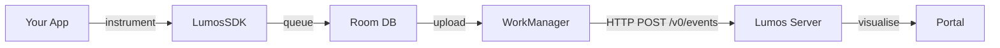

<div align="center">
  
  <h1>LumosSDK</h1>
  <p><strong>AI observability for Android</strong></p>

  
  
  
</div>

---

LumosSDK traces every AI conversation in your Android app and ships the data to a self-hosted backend. The companion web portal visualises latency, token usage, error rates, and user satisfaction over time.

## Installation

```kotlin
// build.gradle.kts (app module)
dependencies {
    implementation("com.lumos:lumos-android:0.1.0")
}
```

Add to `AndroidManifest.xml`:
```xml
<uses-permission android:name="android.permission.INTERNET" />
```

## Quick Start

```kotlin
// Application.kt
class MyApp : Application() {
    override fun onCreate() {
        super.onCreate()
        Lumos.init(this) {
            apiKey    = BuildConfig.LUMOS_API_KEY
            serverUrl = "https://your-lumos-server.com"
            debug     = BuildConfig.DEBUG
        }
    }
}

// In your AI screen
val trace = Lumos.startTrace("chat")
trace.input     = userMessage
trace.output    = aiResponse
trace.model     = "gpt-4o"
trace.tokensIn  = promptTokens
trace.tokensOut = completionTokens
Lumos.endTrace(trace)

// Record feedback
Lumos.feedback(trace.id, Feedback.ThumbsUp)
```

## Configuration

| Field | Type | Required | Description |
|-------|------|----------|-------------|
| `apiKey` | `String` | ✓ | API key from the portal (Apps → API Keys) |
| `serverUrl` | `String` | ✓ | Base URL of your Lumos server |
| `debug` | `Boolean` | | Log trace events to Logcat. Default: `false` |

## How it works



## API Reference

| Method | Signature | Description |
|--------|-----------|-------------|
| `init` | `init(context, block)` | Initialise the SDK. Call in `Application.onCreate()`. |
| `startTrace` | `startTrace(feature): Trace` | Begin a new trace for one AI interaction. |
| `endTrace` | `endTrace(trace)` | Finalise and queue for upload. |
| `feedback` | `feedback(traceId, Feedback)` | Record thumbs up or down. |
| `flush` | `suspend flush()` | Force immediate upload of queued events. |
| `shutdown` | `shutdown()` | Cancel the upload coroutine scope. |
| `setListener` | `setListener(LumosListener)` | Attach upload success/failure callbacks. |

## Portal

The companion portal displays real-time AI observability metrics. Access it at your self-hosted server URL.

→ [Full documentation](https://your-lumos-server.com/docs)

## License

MIT © 2026 LumosSDK
